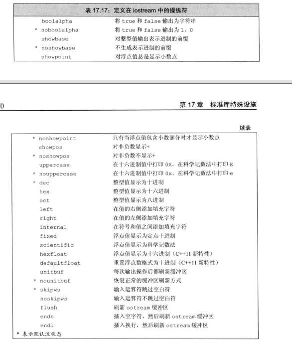
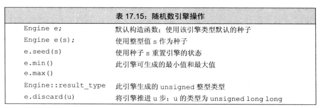

# C++ 知识
[TOC]
##  基本类型
### 算术类型

|  类型   | 字节数  | 备注|
|  ----  | ----  |----  |
| short  | 2 |
| int  | 4 |
| long  | Windows下 4；Linux下4(32位)，8(64)位 |
| long  long | 8 |
| float | 4 | 7位有效数字|
| double| 8 | 15~16位有效数字|
| char| 1 | 
| bool| 1 | 
|指针 | 32位下为4，64位下为8||

```cpp
bool flag;
cin << flag;//不能输入“true”和“false”
```
### 类型转换
注意有符号和无符号之间的转换
当一个算式既有有符号又有无符号时候，值为无符号值
### 进制的表示
```
20   十进制
024  八进制
0x14 16进制
```
### 浮点数的表示
```
3.14
3.14e2 //3.14*10^2
3.14e-2 //3.14*10^(-2)
3.14E2 //3.14*10^2
```

### 转义序列


### 字面值常量


##  变量
### 变量的初始化
```
int a = 10;
int a = {10};
int a(10);
int a{10};
```
变量的初始化不是赋值，赋值是将原变量的值先擦除在给值。

下面是一些错误和有问题的初始化
```
std::cin >> int input_value          // 错误，不能在输入输出语句中定义变量。
int i = { 3.14 };                // 错误，在初始化列表中使用浮点型初始化int变量可能会丢失数据，编译器会拒绝执行
double salary = wage = 9999.99;      // wage未定义，如果wage定义了，则该语句可以正常执行，最终wage和salary相等
int i = 3.14;        // 警告，有隐式转化，i值为3。
```

### 作用域
```cpp
int a = 10;
int main(){
    int a；//a不是外面的a 
}
a = 10;//a是外面的a，a=10
```
##  3.复合类型
### 3.1.引用
引用即给对象别名，两者是绑定在一起的，引用必须初始化，初始化后不可改变
引用的本质是一个指针常量，即指针指向的地址不能改变
```cpp
int a = 10;
int &b = a;//b是a的别名，a和b一起变
int &b;//是错误的
int &b = 0;//是错误的
```

### 3.2.指针
指针也是指向一个对象的复合类型

- 1.指针本身就是一个对象，允许赋值和拷贝，且在生命周期内可以指向不同的对象
- 2.指针可以不初始化，但这样会有个随机的值
- 3.指针可以获取对象的地址
- 4.一个之中不管指向何种数据类型，其本身所需的内存大小是固定的
```cpp
int a = 10;
int *p = &a; //p是指向int类型的指针，用来存放a的地址
cout << *p;//输出p指向地址对应的值
cout << p;//输出p指向的地址
```
- 4.空指针
```cpp
int *p = nullptr;
//空指针不能访问
```
- 5.void指针
void指针可以存放任何类型的地址
```cpp
int a = 10;
void *p = &a; //p是指向int类型的指针，用来存放a的地址

```
- 6.指向指针的指针
```cpp
int a = 10;
int *p = &a; //p是指向int类型的指针，用来存放a的地址
int **p1 = &p;
```

- 7.指向指针的引用
```cpp
int a = 10;
int *p  //p是指向int类型的指针
int *&r = p;//r是对指针p的一个引用
r = &a;//p会指向a
*r = 0;//a的值变0
```


- 9.野指针
  指向非法空间的指针
  ```cpp
  int *p = (int *)0x011;
  ```
  野指针也不能访问

- 10.指向函数的指针
```cpp
int (*pf(int));//这是一个指向形参为int,返回值为int的指针
int (*pf())[20];//这是一个指向形参为void ,返回int数组的函数指针
int (*pf())[20]{
    int (*pear)[20];
    pear = calloc(20,sizeof(int));
    if(!pear) longjmp(error,1); 
    return pear;
}
```

- 受限指针restrict
不允许除p以外的方式访问p指向的对象
源码里经常用到，往往表示两个参数不能指向同一个对象
```cpp
int * restrict p;
```
### const

- 初始化和const
const要初始化
```cpp
int a = 10;
const int b = a;//允许
int c = b;//允许
```
- const仅对当前文件有效，但可以用extern
- const和引用
```cpp
const int a = 10;
int b = 20;
const int &r1 = a;//正确
const int &r2 = b;//正确
int &r3 = a;//错误，const引用只能引用const
const int &r4 = 30;//正确
//常常用作形参
void fun(const int &r);//防止r被修改

int a = 10;
int &r = a;
const &r1 = a;
r = 0;//正确，a变为0
r1 = 0;//错误
```
- const和指针
**口诀：const修饰什么就不能改变什么**
常量指针：const修饰指针
  指针指向的值不可以改变，但指向的地址能改变 
```cpp
int a = 10;
const int *p = &a//const没有修饰p
``` 
指针常量：const修饰常量
  指针指向的值可以改变，但指向的地址不能改变 
```cpp
int a = 10;
int * const p = &a//const修饰指针p,记住不是修饰*

``` 
  - 
    - 指针指向的值不可以改变，但指向的地址不能改变 
```cpp

int a = 10;
const int * const p = &a

``` 

### constexpr和指针(看得不是很明白)
```
const int a = getsize();//不是常量表达式
constexpr int a =getsize();//是常量表达式
```
### 3.5.处理类型
1.typedef
```cpp
typedef int *ptr;//ptr是一个int类型指针
typedef int (*fun)();//fun是一个值为int的函数指针
typedef int arr[5]; //arr是一个长度为5的int数组
```
2.auto
3.decltype
返回操作数的数据类型
```cpp
decltype(fun()) sum = x;类型是fun()函数返回的类型
```
decltype((var))双括号的结果是引用
decltype(var)单括号内只有var是引用才会返回引用\
decltype(var1=var2)返回的是var&

4.register
存放在寄存器里
用于需要频繁访问的变量
```cpp
register int i;
```
### 3.6.右值引用
通过&& 而 不是 & 来获取右值引用
一般绑定到即将要销毁的对象
不能将右值引用绑定到左值上
```cpp
int i = 42;
int &&r = i;//错误，i是个左值阴影
int &&r = i*42;//正确，i是个右值引用
int &&r = 42;//正确，字面值常量是右值
int &&r1 = r;//错误,rr1是左值
```
### 3.7.move函数
```
int &&rr = std::move(4)
```
## 结构体,联合,指针
### 结构体
```cpp
struct Book
{
    std::string name;//书名
    int num = 0;//售出数目
    double price = 0.0;//售出价格
};


struct Book book = {"book",10,1};
struct Book books[3] =  {
                        {"book1",10,1},
                        {"book2",20,21},
                        {"book2",30,3},
                    }

struct Book
{
    std::string name;//书名
    int num : 5;//声明占5位
    double price = 0.0;//售出价格
};
```

### 结构体与指针
```cpp
struct Book
{
    std::string name;//书名
    int num = 0;//售出数目
    double price = 0.0;//售出价格
};

struct Book book = {"book",10,1};
struct Book *p = &book;
cout << p->name;
```

### 联合union
联合和结构体类似，但联合的空间大小由内部最大的决定,可以节省很多空间
```cpp
//U的大小是由double的大小决定的
union U{
    int a;
    double b;
}
```

### 枚举enum
```cpp
enum sizes{
    small = 7,
    medium,
    large = 10
};
```

## 5.命名空间
1.头文件应不包含using声明
2.命名空间定义
```cpp
namespace ppp 
{
    class A{...};
}
namespace P = ppp;//那样P相当于ppp
PPP:: A *a = new PPP::A();
```

3.using不能出现在类的定义域内
4.和作用域
```cpp
namespace A 
{
    int i;
}
void fun(){
    using namespace A;
    cout<<i;//A里面的i
}

int i;
void fun1(){
    using namespace A;
    ++i;//二义性错误
    ++::i;//全局i
    ++A::i;//A的i
}
```

## 容器

### vector 
vector相较于数组是动态空间，可以动态扩展
- vector构造函数
```cpp
vector<T> v;//采用模板方式实现
vector(v.begin(),v.end());
vector(n,elem);//用n个elem
vector(const vector &vec);//拷贝狗仔函数

//演示一下
vector<int> v1(10,1);
vector<int> v2(v1.begin(),v2.begin());
vector<int> v3(v1);
```
- 赋值操作
```cpp
vector& operator =(const vector&vec);
assign(beg,end);
assign(n,elen);//n个elem赋值给容器
```

- 容量与大小操作
```cpp
empty();//是否为空
capacity();//容器的容量
size();//返回容器中元素的个数
resize(int num);//重新指定容器的长度，如果容器变长，则以默认值填充，变短，则删除
resize(int num,elem);//重新指定容器的长度，如果容器变长，则以elem填充，变短，则删除
```
- 插入与删除
vector扩容时候，容量是成倍增长的
```cpp
push_back(e);
pop_back();//删除最后一个元素
insert(const_iterator pos,ele);//指定pos插入ele
insert(const_iterator pos,int count ,ele);//指定pos插入count个元素ele
erase(const_iterator pos);//删除pos位置的元素
erase(const_iterator star,const_iterator end);//删除star到end之间的元素
clear();//清除元素
```

- 数据读写
```cpp
at(int i);
operator[](int i);
front();//返回第一个元素
back();//返回最后一个元素
```

- 元素互换
```cpp
swap(vec);//将自己本身与vec互换
```

-预留空间
```cpp
reserve(int len);//容器预留len个元素长度，预留位置不初始化，元素不可访问                                                                                                                                                                     
```


### string
- 与char *区别
char*是一个指针
string是一个类
- 构造
```cpp
string();//空串
string(const char* s);
string(const string& str);
string(int n,char c);//n个c初始化
```
- 赋值
```cpp
string& operator=(const char* s);
string& operator=(const string &s);
string& operator=(char c);

string& assign(const char* s);
string& assign(const char* s,int n);//字符串前n个字符赋值
string& assign(const string& s);
string& assign(int n,char c);//n个c
```
- 拼接
```cpp
string& operator+=(const char* s);
string& operator+=(const char c);
string& operator+=(const string& s);

string& append(const char* s);
string& append(const char* s,int n);//字符串前n个字符拼接
string& append(const string& s);
string& append(int n,char c);//n个c
```
- 查找和替换
```cpp
int find(const string& str,int pos = 0);//从位置pos开始查找str
int find(const char* str,int pos = 0);
int find(const char* str,int pos ,int n);//从pos查找s的前n个字符
int find(char c,int pos = 0);

int rfind(const string& str,int pos = 0);//从倒数位置pos开始查找str
int rfind(const char* str,int pos = 0);
int rfind(const char* str,int pos ,int n);//从倒数pos查找s的前n个字符的位置
int rfind(char c,int pos = 0);

string& replace(int pos,int n,const string&str);//从pos开始n个字符替换为str
string& replace(int pos,int n,const char *str);//从pos开始n个字符替换为str
```

- 字符串比较
```cpp
int compare(const string& s) const;
int compare(const char* s) const;
```

- 按索引读写
```cpp
char &operator[](int n);
char &at(int n);
```

- 插入和删除
```cpp
string& insert(int pos,const char*s);
string& insert(int pos,const string& str);
string& insert(int pos,int n,char c);
string& erase(int pos,int n = npos);//删除从Pos开始的n个字符
```

- 字串获取
```cpp
string substr(int pos = 0,int n = npos) const;//返回从pos开始的n个字符
```

- 其他
```cpp
char c
isalnum(c);//是否为数字或字符串
tolower(c);//转化为小写
```

- C风格字符
```cpp
size_t strlen(char *)//字符串长度
char *strcat(char *s1,const char *s2);//拼接字符串,也可以用来复制字符串
int strcmp(const char *s1,const  char*s2)//比较字符串 
```

### deque容器
双端队列，头端可进行插入删除操作
- 与vector区别
vector头插效率低
deque头插和删快
vector访问元素快
- 构造函数
```cpp
deque<T> d;
deque(beg,end);
deque(n,elem);
deque(const deque&d);
```

- 赋值hanshu
```cpp
deque &operator=(const deque&d);
assign(beg,end);
assign(n,elem);
```

- 大小操作
```cpp
deque.empty();
deque.size();
deque.rsize(num);//重新指定容器长度为num，变长以默认值填充，变短删除
deque.rsize(num,elem);//重新指定容器长度为num，变长以num填充，变短删除
```

- 插入删除
```cpp
push_back(elem);
push_front(elem);//头插
pop_back();//
pop_fornt();

insert(pos,elem);//pos位置插入elem
insert(pos,n,elem);//pos位置插入n个elem
insert(pos，beg,end);//pos位置插入beg到end
clear();
erase(beg,end);
erase(pos);
```

- 读写
```cpp
at(int i);
operator[];
front();//返回第一个元素
back();//返回最后一个元素
```
### stack
先进后出
- 构造
```cpp
stack<T> s;
stack(const stack&s);
```

- 赋值
```cpp
stack& operator=(const stack &stk);
```

- 数据存取
```cpp
push(elem);//向栈顶添加元素
pop();//从栈顶移除第一个元素
top();//返回栈顶元素
```

- 大小操作
```cpp
empty();
size();
```

### queue
先进先出
- 构造
```cpp
queue<T> s;
queue(const stack&s);
```

- 赋值
```cpp
queue& operator=(const queue &stk);
```

- 数据存取
```cpp
push(elem);//向队尾添加元素
pop();//从队头移除第一个元素
back();//返回最后一个元素
front();//返回第一个元素
```

- 大小操作
```cpp
empty();
size();
```

### list
双向链表
- 构造函数
```cpp
list<T> l;
list(beg,end);
list(n,elem);
list(const list&lst)
```

-赋值与交换
```cpp
assign(beg,end);
assign(n,elem);
list& operator=(const list &lst);
swap(lst);//将lst于本身的元素互换
```
- 大小操作
```cpp
empty();
size();
rsize(num);//重新指定容器长度为num，变长以默认值填充，变短删除
rsize(num,elem);//重新指定容器长度为num，变长以num填充，变短删除
```
- 插入删除
```cpp
push_back(elem);
push_front(elem);//头插
pop_back();//删除最后一个
pop_fornt();//删除第一个

insert(pos,elem);//pos位置插入elem
insert(pos,n,elem);//pos位置插入n个elem
insert(pos，beg,end);//pos位置插入beg到end
clear();
erase(beg,end);
erase(pos);
remove(elem);//删除容器中所有于elem值匹配的元素
```

- 数据存取
```cpp
front();//返回第一个元素
back();//返回最后一个元素
```

- 反转
```cpp
reserve();//反转
```

### set/multiset
底层：二叉树
set:不可重复，插入数据时返回是否成功，默认从小到大排
```cpp
pair<set<int>::iterator bool> ret = s.insert(10);
if(ret.second){
    //成功插入
}
```
multiset:可重复，插入数据时不会检测是否成功
- 构造
```cpp
set<T> s;
set(const set& s);
```

- 赋值
```cpp
set& operator=(const set &s);
```

- 大小操作和交换
```cpp
size();
empty();
swap(st);//交换两个容器
```

- set插入和删除
```cpp
insert(elem);
clear();
erase(pos);
erase(beg,end);
erase(elem);
```

- 查找
```cpp
find(key);
count(key);
```
- 改变排序规则
1.
```cpp
class Mycompaer{
    public:
    bool operator()(int v1,int v2){
        return v1>v2;
    }
}

set<int,Mycompaer> s;
s.insert(19);
s.insert(38);
s.insert(20);//将会从大到小排序
```

2.自定义的类型一定要指定排序规则
```cpp
class Person(){
    private:
    int age;
    string name;
    public:
    Person(string name,int age);
}
class Mycompaer{
    public:
    bool operator()(const Person& v1, Person& v2){
        return v1.getage()>v2.getage();
    }
}

set<Person,Mycompaer> s;
Person p1("11",1);
Person p1("22",3);
Person p1("33",2);
s.insert(p1);
s.insert(p2);
s.insert(p3);//将会从大到小排序
```
### pair
成对出现的数据
```cpp
pair<type,type> p(value1,value2);
pait<type,type> p = make_pair(value1,value2);

p.first;//第一个数据
p.second;//第二个数据
```

### map/multimap
map所有元素都为pair
第一个元素为key,第二个元素为value
所有元素按照key自动排序
本质：关联容器，二叉树

map:不允许重复key
multimap:允许重复key

- 构造
```cpp
map<T1,T2> m;
map(const map& m);
```

- 赋值
```cpp
map& operator=(const map& m);
```

- 大小于交换
```cpp
size();
empty();
swap(m);//交换两个集合容器
```

- 插入与删除
```cpp
insert(elem);
clear();
erase(pos,beg);
erase(key);
```

- 查找
```cpp
find(key);
count(key);
```

- 排序
默认以key进行排序
```cpp
class MyCompare{
    public:
    bool operator()(int v1,int v2){
        return v1 > v2;
    }
};

map<int,int,MyCompare> m;//key将会以从大到小排序
```

## 8.迭代器
### 8.1.迭代器运算

### 8.2.迭代器类型
type::iterator it
```
string::iterator it1;//能读写
vector<int>::iterator it2;
string::const_iterator it1;//只能读
```
容器里的begin()和end()类型是迭代器
### 8.3.迭代器和引用
*it
如果引用对象是类，就可以用它的方法啦
eg.(*it).empty

### 8.3.iostream迭代器
1.istream迭代器


```cpp
istream_iterator<int> in_iter(cin);//从cin读取int
istream_iterator<int> eof;//定义为空
while(inter!=eof)
     v.push_back(*in_iter++);
```

2.ostream迭代器

```cpp
istream_iterator<int> in_iter(cin);//从cin读取int
istream_iterator<int> eof;//定义为空
ostream_iterator<int> out_iter(cout," ");//输出int,末尾添加“ ”
while(in_iter!=eof)
    sum += *in_iter++;
out_iter = sum;
```


### 8.4.反向迭代器
```cpp
auto it = vec.crbegin();//指向末尾
vec.crend();//指向末尾
++it;//实际是递减
```
## 9.数组
### 9.1.数组初始化
数组存放在连续的内存空间中
```cpp
const unsigned int size = 10;
int size2 = 2;
int a[size];
int b[10];
int c[size2];//错误
int d[fun();];//当fun()时constexpr时正确
```

```cpp
//显式子定义
const unsigned int size = 10;
int a[size] = {1};//第一个元素为1
int b[10] = {0,1,2};//前3个元素为0，1，2，为补齐的用0填充
int c[];={1，2，3}//长度为3，内容为1，2，3的数组
```
数组和字符串
```cpp
//显式子定义
char a[3] = "C++";//错误
char a[4] = "C++";//正确，最后一位是‘\0’
char a[] = "C++";//正确，长度为4
```

注：数组不允许相互拷贝

复杂的初始化
```
int *p1[10];//p1是含有10个整型指针的数组
int (*p2)[10];//p2指向含有10个整数的数组
int &r1[10];//错误不存在数组引用
int (&r2)[10];//r2引用1个含有10个整数的数组
```
### 9.2.指针与数组
```cpp
int a[10] = {……};//
int *p1 = &a[0];
int *p2 = a;//相当于上面
auto p3(a);//p3是指一个指针
p3 = 42;//错误，p3是个指针，不能直接赋值
auto p4(&a);p4是int *
decltype(a) p4 = {……};//
p4 = 1;//错误
p4[0] = 1;//正确
```

### 9.3.多维数组
数组的数组
1.初始化
```cpp
int a[行][列];//我当然知道[]里面不能写中文啦
int a1[10][10]={0};//全初始化为0
int a2[2][3]={
    {1，1，1}，
    {1，1，1}
}；
int a3[2][3]={1，1，1，1，1，1}；
int a2[2][3]={
    {1}，
    {1}
}；//初始化每行首个元素
int a4[][3] = {1,2,3,4,5,6};//2行3列

```
2.多维数组与引用，指针
```cpp
int a[3][4];
int (&row)[4] = a[1];//row绑定到第二行的四元素上
int (*p)[4] = a[1];//p指向第二行的四元素


i = *(a[1]+2);//a[1][2]
i = *(*(a+1)+2)

int *p = a[1];//指向第2行
int *p = a;//非法
int (*p)[4] = a;//括号一定要有 []优先级更高
```
3.多维数组与auto
```cpp
int a[3][4];
for (auto p = a;p!=a+3;p++){
    for (auto q = *p;q!=*p+4;q++)；//q指向一个长度为4的数组的首元素
}//p指向四元素
for (auto p = begin(a);p!=end(a);p++){
    for (auto q = begin(*p);q!=end(*p);q++);//q指向这一行的第一个元素
}p指向第一行
```
4.二维数组常用的技巧
```cpp
int arr[2][3]
//注意sizeof返回的是无符号类型的

sizeof(arr);//占用内存大小
sizeof(arr[0]);//1行占用内存大小
sizeof(arr[0][0]);//1个元素占用内
sizeof(arr/arr[0]);//行数
sizeof(arr[0]/arr[0][0]);//行数
cout <<int(arr);//首地址
cout <<int(arr[0]);//第一行首地址
```
### 9.4 数组的一些常用技巧
```cpp
int a[] = {...}
sizeof(a);//统计数组在内存中的长度
sizeof(a[0]);//统计数组一个元素在内存的长度
sizeof(a)/sizeof(a[0]);//获得数组长度
cout <<a ;//输出数组首地址
cout <<&a[0] ;//输出数组首元素地址，地址和上面一样
```

## 10.表达式
### 10.1.+，-，*，%，/
### 10.2.逻辑运算符
！,&&,||
<,>,=,<=,>=,==,!=
### 10.3.递增递减运算符
a=i++;//a=i,i在自增
a=++i;//i先自增，再赋值给a
### 条件运算符
A:B?C;//如果A为真则执行B，否则执行C
### 位运算符
```cpp
i |= 1<<j;//set bit j
i &=~(1<<j);//clear bit j
i ^= (1<<j);//切换i位置

•int __builtin_ffs (unsigned int x)
返回x的最后一位1的是从后向前第几位，比如7368（1110011001000）返回4。
•int __builtin_clz (unsigned int x)
返回前导的0的个数。
•int __builtin_ctz (unsigned int x)
返回后面的0个个数，和__builtin_clz相对。
•int __builtin_popcount (unsigned int x)
返回二进制表示中1的个数。
•int __builtin_parity (unsigned int x)
返回x的奇偶校验位，也就是x的1的个数模2的结果。
```
### sizeof
统计类型所占大小
```
sizeof(p);//p是一个指针，表述地址的大小，64位系统是8，32位是4
sizeof(*p)；//表示指向对象类型的大小
sizeof(int)*p//这里表示一个int的字节大小乘上p
```
### 强制转换


cast_name&lt;type>(experssion)
type表示转换的目标类型
experssion表示要转换的值

cast_name:
- 1.static_cast
只要不包含底层const(声明指向常量的指针也就是 底层const)，就可以使用static_cast
```cpp
void *p = &b
double *dp = static_cast&lt;double *>(p)
```


- 2.const_cast
改变对象的底层const
const char *c
char *cc = const_cast&lt;char *>c
const_cast&lt;string>c是错误的，const_cast不能转换类型

- 3.reinterpret_cast
用来处理无关类型之间的转换；它会产生一个新的值，这个值会有与原始参数（expression）有完全相同的比特位。
- 4.C语言的强制转换
  (类型名)表达式
  类型名是一元运算符，优先级高于二元
  ```cpp
  long i;
  int j = 10000;
  i = j*j;//溢出
  i = long j*j;//相当于（（long）j）*j  l*i->l;
  i = long (j*j);//溢出
  ```
### 运算优先级


## 11.语句
### 11.1.条件语句
1.if
2.switch
```
switch(a){
    case A :
    case B :
    default:
    }
```
### 11.2.迭代语句
1.while
2.for
2.1.传统for
for(初始化；条件；表达式){
    。。。。。。
}
2.2.范围for
3.do while

### 11.3.跳转语句
1.break
2.continue:终止当前迭代，并立即开始下一次循环
3.goto语句:平时尽可能少使用goto
结构 goto 标记
```cpp
begin:
    int s = get_value();
    if(s < 0)
        goto begin;
```

### 11.4.异常处理语句
1.例子
```cpp
int a1 = 0, a2 = 0;
while (cin >> a1 >> a2) {
	try {
		if (a2 == 0)
			throw runtime_error("0 can't be used as a divisor!");
                   //runtime_error 定义在stdexcept头文件中
		cout << static_cast<double>(a1) / a2 << endl;//用到前面学过的显示转换
		cout << "please input two numbers: " << endl;
	}
	catch (runtime_error err) {
		cout << err.what() << " \nTry again? Enter y or n " << endl;
		char c;
		cin >> c;
		if (!cin || c == 'n')//如果不输入或者输入 n 
			break;//结束当前循环
	}
}
```
2.常见异常


3.noexcept
```cpp
void fun(int) noexcept;//不会抛出异常
void fun(int) noexcept(true);//不会抛出异常
void fun(int) noexcept(false);//可能抛出异常

noexcept(fun);//fun如果没有抛出异常则返回true


//跟类的继承
class Base{
    public:
        virtual double f1() noexcept;
        virtual double f2() noexcept(false);
        virtual double f3() ;
}

class Derived : public Base{
    public:
        double f1() noexcept;//错误，必须和基类一样
        double f2() noexcept(false);//正确
        double f3() noexcept;//正确。比基类做更严格的定义
}
```
noexcept函数里面不能用throw,虽然能编译通过
***
## 12.函数
函数可以声明多次
但是只能定义一次
### 12.1.实参与形参
 形参:在函数参数列表中声明的局部变量，它们由每个函数调用中提供的参数初始化，作用是说明函数参数的类型。
 实参:函数调用中提供的值，用于初始化函数的参数

### 12.2.局部对象
局部变量:定义在一个块中的变量。
形参:在函数参数列表中声明的局部变量，函数终值，形参也被销毁。
局部静态变量:在第一次执行通过对象定义之前初始化局部静态变量(对象)。函数结束时不破坏局部静态;它们在程序终止时被销毁。

### 12.3指针形参
```cpp
//传入的是指针，指针是指向地址的变量
int fun(int *p){
    *p = 0;//指针指向地址对应的值改变
    p = 0;//这是形参，实参p指向的地址没有改变
}
```
### 12.4引用传值
```cpp
int fun(int &r){
    r = 0;//r的值改变了
}
```

使用引用可以避免拷贝，尤其在类较大的时候

### 12.4传递数组
```cpp
void fun(int a[]);// void fun(int *a)
int a[10] 
fun(a)
```

```cpp
void fun(int (&a)[10]);// void fun(int *a)
int a[10]; 
int b[2];
fun(a);//正确，a是一个长度为10的
fun(b);//错误
```

### 12.5 initializer_list形参

```cpp
int Sum(const initializer_list<int> &il)
{
	int sum = 0;
	for (auto& it : il)
	{
		sum += it;
	}
 
	return sum;
}
```

### 12.6函数返回
1.不要返回局部对象的引用
```cpp
int &test0(){
    int a = 10;
    return a;//错误
}

int &test1(){
    static int a = 10;
    return a;//正确，static存放在全局区
}
int &ref = test1;//ref = 10
&test1() = 1000；//正确的操作的，那样返回1000,ref=1000,如果函数返回引用，可以作为左值
```
2.返回指针数组
```cpp
string (&func())[10];//一个返回包含10个String的函数的声明

//类型别名
typedef string arr[10];
arr& func();

//使用尾置返回类型：
auto func()->string(&) [10];

//使用 decltype 关键字：
string str[10];
decltype(str)& func();
```

### 12.7函数重载
1.同一作用域下，函数名字相同，但形参列表不同
2.const
```cpp
//下面两个不是重载
int fun (int);
int fun (const int);
//下面是重载
int fun (int&);
int fun (const int&);
int a = 10;
fun(a);//int fun (int&);
fun(10);//int fun (const int&);


int fun (int*);
int fun (const int*);


//注意默认形参
void fun(int a,int b = 10);
void fun(int a);
fun(a);//错误
```
3.最佳匹配
```cpp
f(double,int);
f(int,double);
f(3.14,1);//没有最佳匹配，所以调用错误
```

### 12.8默认形参
注意：默认形参应该放在最后面
```cpp
int fun (int a, int b = 10 ,char c = '');
fun(1）;//相当于fun(1,10,'')
```

### 12.9内联
inline 用于规模小，流程直接，调用频繁的函数

### 12.10constexper函数
返回字面值的函数
注:inline 和 constexper函数定义在头文件种

### 12.11调试帮助
1.assert
2.如果 #define NODEBUG,将不会调用assert

### 12.12函数指针
1.指向函数的指针
```cpp
bool (*pf)(int ,int);
bool fun(int,int)
pf = fun;
pf = &fun;
pf = 0;//pf不指向任何函数
pf(1,1);
```
当指向重载函数时，只能运行参数匹配的函数
2.形参指向函数
```cpp
bool fun(int,int,bool (*pf)(int ,int));
bool fun1(int,int);
fun(1,1,fun1(1,1));
```
3.返回指向函数的指针
```cpp
using PF = (int*)(int ,int);//PF是指针类型
PF f1(int,int);
PF *f1(int,int)
```

4.编写函数声明，令其接收两个int,返回int，声明vector，令其元素是指向函数的指针
```cpp
int func(int a, int b);

using pFunc1 = decltype(func) *;
typedef decltype(func) *pFunc2;
using pFunc3 = int (*)(int a, int b);
using pFunc4 = int(int a, int b);
typedef int(*)(int a, int b) pFunc5 ;
using pFunc6 = decltype(func);

std::vector<pFunc1> vec1;
std::vector<pFunc2> vec2;
std::vector<pFunc3> vec3;
std::vector<pFunc4*> vec4;
std::vector<pFunc5> vec5;
std::vector<pFunc6*> vec6;

```

5.example
```cpp
int add(int a,int b) {return a+b;}
int subtract(int a, int b) { return a - b; }
int multiply(int a, int b) { return a * b; }
int divide(int a, int b) { return b != 0 ? a / b : 0; }

using pFunc = decltype(func) *;
std::vector<pFunc> vec = {&add,&subtract,&multiply,&divide};

for (auto f : vec)
    std::cout << f(2, 2) << std::endl;
```
### 12.13.函数与const
```cpp
void fun(const xxx);//xxx在函数内部不能修改
```
### 函数对象
重载函数调用操作符的类，器对象成为函数对象

重载（），行为像函数调用，也叫仿函数

仿函数是一个类，不是一个函数

```cpp
class Add{
    public:
    int operator()(int a,int b){
        return a+b;
    }
}

Add add;
add(10,10);
```
### 谓词
返回bool类型的仿函数
如果operator接收1个参数则为一元谓词
如果operator接收2个参数则为2元谓词
* * *
## 13.类
class和struct差不多，struct默认权限是public,class默认权限是私有
### 类的内存情况
- 成员函数不占用类对象的内存空间
- 一个类对象至少占用1个字节的内存空间
- 成员变量是占用对象的内存空间
- 成员函数 每个类只诞生 一个（跟着类走），而不管你用这个类产生了多少个该类的对象;
- 类的非静态成员变量存在在类的内部，静态成员不保存在内部
- 虚函数：不管几个虚函数，sizeof()都是多了4个字节
  - 类里只要有一个虚函数（或者说至少有一个虚函数），这个类会产生一个指向虚函数表的指针
  - 类本身 指向虚函数的指针（一个或者一堆）要有地方存放，存放在一个表格里，这个表格我们就称为“虚函数表(virtual table【vtbl】)”；这个虚函数表一般是保存在可执行文件中的，在程序执行的时候载入到内存中来。虚函数表是基于类的，跟着类走的
  - 因为有了虚函数的存在，导致系统往类对象中添加了一个指针，这个指针正好指向这个虚函数表，很多资料上把这个指针叫vptr；这个vptr的值由系统在适当的时机（比如构造函数中通过增加额外的代码来给值）；
### 13.1类的构造函数
当用定义类时，C++会提供默认构造函数，默认析构函数,默认拷贝函数，赋值构造函数（operator=）,这些都是inline的,且其不会初始化成员函数
当用于定义构造函数，将不会提供默认构造
当用于定义拷贝函数，将不会提供其他构造函数

```cpp
  Person(/* args */);
  Person(int age);
  //下面这个构造函数后面赋值顺序是跟name，address声明顺序一样的。建议使用如下的初始化方式，这种方法效率更高
  Person(std::string name, std::string address) :name(name), address(address) {}
  //委托构造函数(初始化列表)
  Person(std::string name):Person(name,"none"){}
  Person(const Person &person);//拷贝构造函数
  /******构造函数使用*******/
  //括号法
  Person person();//这是声明了一个函数
  Person person1;//这是声明了一个类
  //显示法
  Person p1 = Person(10);
  Person p2 = Person(p1);

  Person(10);//这是个匿名对象，在使用后立刻销毁
  //隐式
  Person p3 = 10;
  Person p4 = p3;
```
注意：如果没有默认构造函数，不能无参数初始化
- 1.拷贝构造函数
  - 使用已经创建的来初始化另一个对象
  - 函数值传递的方式
  - 以值方式返回局部对象
- 2.深拷贝与浅拷贝
  - 深拷贝：在堆区重新申请空间拷贝
  - 浅拷贝：简单的赋值，有new的时候，可能会导致堆区的重复释
  放  
- 3.类成员中有类
构造时候先构造成员类，在构造自己，析构时先析构自身，再析构成员类
```cpp
class Person{
    private:
        int age;
        int *heigh;
    public:
        Person(const &p){
            age = p.age;
            //heigh = p.heigh;//浅拷贝，导致指针指向的地址一样，会导致析构时重复释放堆区内存
            heigh = new int(*p.heigh);//深拷贝，取值并且重新指向新的地址

        }
        ~Person(){
            if(heigh != NULL){
                delete heigh;
                heigh = NULL;
            }
        }
}
``` 
### 13.2类的权限

private:类内可以访问，类外不可访问，派生类不能访问
protect:类内可以访问，类外不可访问，派生类可以访问
public:类内可以访问，类外可以访问，派生类可以访问
### 13.3 this
由于类的成员函数是共享一份实列的，为了区分哪个类调用，引入this
this指向被调用的成员函数所属的对象
在 C++ 中，每一个对象都能通过 this 指针来访问自己的地址。this 指针是所有成员函数的隐含参数。因此，在成员函数内部，它可以用来指向调用对象。
友元函数没有 this 指针，因为友元不是类的成员。只有成员函数才有 this 指针。


用法：
形参和成员变量同名
类的非静态成员函数返回本身return *this;
```cpp
inline Screen& Screen::set(char c) {
    contents[cursor] = c;
    return *this;
}
```
上面这个操作首先函数是引用，不是引用将会返回函数的副本，从而对类本身没有产生影响

### 13.4 友元friend
- 1.一些概念
  - 1.允许其他类和函数访问非公有成员
  - 2.如果一个类指定了友元类，则友元类允许这个类的非公有成员
  - 3.令成员函数作为友元：即只允许某个类的函数访问非公有成员
  - 4.如果想把重载函数声明为友元，用到哪个友元哪个
  - 5.在类内部定义的友元函数也需要在外部重新声明，但是有些编译器可以忽视这条了
- 2.全局函数如果想要访问类的私有成员，可以把全局函数声明为友元 
- 3.友元类
```cpp
class A{
    friend class B;//可以访问B的私有成员
}
```
- 4.成员函数友元
```cpp
class A{
    friend void B::visit();//B中的visit可以访问A的私有成员
}
``` 
### 13.5 私有部分的函数
定义在私有部分的函数定义为内敛函数，能有效的降低开销
### 13.6 explicit
1.用于抑制隐性转换
2.只能针对一个实参的函数（多个默认关闭隐形）
3.只能用于函数声明处
4.explicit的构造函数只能用于直接初始化
5.但是是可以强制转换的
```cpp

    explicit Person(std::string name):Person(name,"none"){}

/**********************************************************/
    string name = "ppp";
  //  Person person2 = name;//如果构造函数 Person(std::string name)不是explicit是可以的。
   // person2.show(cout);
    Person person3("ppp");

```
### 13.7聚合类
1.所有成员都是public
2.没有定义任何构造函数
3.没有类内初始值
4.没有基类
5.聚合类只能用字面值常量来初始化

### 13.8字面值常量类
1.数据成员都是字面值
2.类必须有一个constexpr函数
3.必须使用析构函数的默认函数
4.如果一个数据成员含有类内初始值，则内置类型的初始值必须是一条常量表达式。或者如果成员属性某种类类型，则初始值必须使用成员自己的constexpr构造函数
```cpp
class ConstPoint
{
public:
    constexpr ConstPoint(int x, int y) :
        x_(x), y_(y) {}
    void setX(int value) { x_ = value; };
    void setY(int value) { y_ = value; };
    constexpr int getX() { return x_; };
    constexpr int getY() { return y_; };
private:
    int x_;
    int y_;
};


int main()
{
 
    ConstPoint point(2, 5);
    point.setX(point.getX()*point.getX()+ point.getX());
    point.setY(point.getY()*point.getY()+point.getY());
    std::cout << point.getX() << " " << point.getY() << std::endl;//直接给出字面值常量，不是运算出来的
    system("pause");
    return 0;
}
```

### 13.9 static
```cpp
class C{
    private:
        static int A;
    public:
        static int B;
        static int fun();

}
//类外初始化
int C::A = 100;
int C::B = 100;

int main(){

    C c1,c2;
    c1.B = 200;//c2也随之改变
    //c1.A = 200;//错误私有变量不能直接访问
    //静态函数的使用
    c1.fun();
    C::fun();
    return 0;
}
```
- **1.类的静态成员**
  - 所有对象共享数据
  - 编译阶段分配内存
  - 类内声明，类外初始化
- **2.类的静态成员函数**
  - 所有对象共享函数 
  - 静态成员函数只能访问静态成员

### 13.10 类的拷贝销毁控制
1.类的拷贝
类的拷贝函数必须是引用
（1）如果一个函数的一个参数是自身类型的引用，且任何额外参数都有默认值，
那么它就是拷贝构造函数。
（2）以下三种对象需要调用该函数
一个对象作为函数参数，以值传递的方式传入函数体
一个对象作为函数返回值，以值传递的方式从函数返回
一个对象用于给另一个对象进行初始化的时候。
```cpp
class F{
    public:
    F(const &F);//拷贝构造函数，必须是引用
    F &operator= (const &f);//重载运算符
}

F &operator= (const &f);//重载运算符
```
2.析构
析构函数释放对象所使用的资源；
析构函数首先执行函数体，然后销毁成员；
在类没有定义析构函数的时候生成。

3.阻止拷贝
在函数后面加上 delete
```cpp
class F{
    public:
    F(const &F) = delete;//类的拷贝,必须在声明的时候使用
    F &operator= (const &f);//重载运算符
}
```
### 13.11运算符重载operat
- 1.可重载的运算符

- 2.自增自减运算符
```cpp
//前置
F operator++(){
    //检查是否到尾部了，无法递增了
    check()
    ++*this
    return this;
}
//后置
F operator++(int){//加了int编译器会认为是后置
    F ret = *this
    ++*this
    return ret;
}
```
- 3.重载类型转换
避免过度使用类型转换
```cpp
//显示转换
F explicit operator int(){

    return val;
}
F  operator int(){

    return val;
}
F ff;
static_cast<int>(ff);
```
- 4.重载<<
一般左移运算符不作为成员函数重载
而作为友元全局函数
```cpp
ostream& operator++(ostream &out,F f){
    //检查是否到尾部了，无法递增了
    out << f.name;
    return out;//这样就能链式输出了
}

cout <<F <<endl;//因为链式输出，所以F后面还能输出endl
```
- 5.赋值
要注意深拷贝
```cpp
class Person{
public:
	Person(int age){
		//将年龄数据开辟到堆区
		m_Age = new int(age);
	}

	//重载赋值运算符 
	Person& operator=(Person &p)
	{
		if (m_Age != NULL)
		{
			delete m_Age;
			m_Age = NULL;
		}
		//编译器提供的代码是浅拷贝
		//m_Age = p.m_Age;
		//提供深拷贝 解决浅拷贝的问题
		m_Age = new int(*p.m_Age);
		//返回自身
		return *this;
	}
	~Person()
	{
		if (m_Age != NULL)
		{
			delete m_Age;
			m_Age = NULL;
		}
	}

	int *m_Age;
};
```


### 空指针
```cpp
class Person{
    private:
        int age;
    public:
        void showperson(){cout << "1";}
        //void showage(){cout << age;}
        void showage(){
            if(this == null)
                return;
            cout << age;
        }


}

int main(){
    Person *p = null;
    p->showperson();
    p->showage();//如果用注释里面的就会报错
}
```

### 13.13const与类
- **1.修饰函数**
  - 函数内部成员变量无法修改
  - 其实质修饰的是this指针，this本质是指针常量，加了const，指向的值也无法修改
  - 如果变量加了关键字mutable,可以修改 
- **2.常对象**
  - const Person p;
  - 常函数只能调用常函数
  - 如果变量加了关键字mutable,可以修改
* * *


## 14 IO库(看的似是而非)
### 14.1 IO类
1.头文件

2.条件状态


Q:编写函数，接受一个istream &参数，返回值也是istream&。此函数必须从给定流中读取数据，直至遇到文件结束标识符时停止。它将读取的数据打印在标准输出上。完成这些操作后，在返回流之前，对流进行复位，使其处于有效状态
```cpp
istream& read(istream &is){
    string word;
    while(is >> word){
        cout << word;
    }
    is.clear();//清除
    return is;
}
```
3.输出刷新缓存区
```cpp
os << endl;//换行并刷新缓存区
os << flush;//刷新缓存区
os << ends;//输出一个空字符并刷新缓存区
os << unitbuf;//每次输出后刷新缓存区
os << nounitbuf;//正常的缓存结构
```
注：程序崩溃后缓存区不会刷新

### 14.2.文件输入输出
1.fstream操作

```cpp
int main(){
    ifstream fin("MYC++//eposide_14//test.txt");
    vector<string> lines;
    vector<string> words;
    if(!fin){//如果无法打开
        cout << "Can't open the file"<<endl;
    }
    // string line;
    // while(getline(fin,line)){
    //     lines.push_back(line);
    // }
    string word;
    while(fin>>word){
        words.push_back(word);
    }
    fin.close();

    // vector<string>::const_iterator it = lines.begin();
	// while (it!=lines.end())
	// {
	// 	cout << *it << endl;
	// 	++it;
	// }

    vector<string>::const_iterator it1 = words.begin();
    while (it1!=words.end())
	{
		cout << *it1 << endl;
		++it1;
	}

    system("pause");
    return 0;
}
```

2.文件模式


### 14.3 string流
1.操作


### 格式化输入输出
- 输出格式
```cpp
cout << endl;//换行
cout << boolalpha;//输出布尔值，true,false;
cout << noboolalpha;//取消布尔值

cout << showbase;//整型显示前缀 16进制0x,8进制0
cout << oct;//8进制
cout << hex;//16进制
cout << dec;//10进制

//浮点操作
cout.precision(2);//精度为2位
cout << scientific;//科学计数法
cout << showpoint << 10.0；//打印小数点
cout << noshowpoint << 10.0；//不打印小数点


//补白
cout << set(12);//补足12位
//配合下面
cout << left;//左对齐
cout << right;//右对齐
cout << internal;//域的内部补白 如 -16 表示为-         16
cout << setfill('#');//域的内部补白'#'
```


- 输入格式
```cpp
cin >> noskips;//能读取空白符号
cin >> skipws;//默认状态，丢弃空白
```

- C语言风格的格式化输出输入
```cpp
//最小字宽5，4位有效数字，右对齐
printf("5.4%d",a);
//最小字宽5，4位有效数字，左边对齐
printf("-5.4%d",a);
//科学计数法
printf("%e",e);
//10进制浮点数，最小字宽5，小数点后4位
printf("5.4%f",e);
//根据数的大小来显示指数还是10进制定点
printf("%g",e);


//格式化输入
scanf("%d %d",&a,&b)
scanf("%d,%d",&a,&b)//a,b之间逗号隔开
```

### 14.5 未格式化输入输出
[未格式化输入输出](images/14.8.PNG)
[未格式化输入输出](images/14.9.PNG)
[未格式化输入输出](images/14.10.PNG)

### 14.6 流随机访问

## 15.泛型算法(仔细应该看看STL)
### 15.1.只读算法
只读取值但不会改变值
```cpp
accumulate();//求和算法，返回int
equal();//比较两个是否相等
```
### 15.2.写算法
```cpp
fill(v.begin(),v.end(),0);//填充0
fill_n(v.begin(),v.end(),0);//填充0
fill_n(p,n,num);//在p指向的n个开始填充
auto it = back_insert(vec);//返回一个指向vec的迭代器
*it = 42;//vec赋值42

copy(begin(a),end(a),b)；//a开始到结束拷贝给b

sort();//排序算法
stable_sort();//用于排序中有相等的元素？？

```

### 15.3.lamda表达式
1.lamda
```cpp
sort(a.begin(),a.end,[](const string &a,const string &b){
    return a.size(),b.size()
})

[sz](const string &a,const string &b){
    return a.size()>sz;//接收参数
})


int main(int argc, char* argv[])
{
    int a = 5,b = 6;
    auto c = [a,b]{ return a+b; };
    auto d = [](int m,int n){ return m+n; }(a,b);
    auto e = [](int m,int n){ return m+n; };
    cout << c()<<endl;//11
    cout << d <<endl;//11
    cout << e(a,b) <<endl;//11
    system("pause");
    return 0;
}
```

2.lamda捕获
```cpp
//值捕获
int val = 42;
auto f = [val]{return val};
val = 0;
auto j = f();//j为42；

//引用捕获
int val = 42;
auto f = [&val]{return val};
val = 0;
auto j = f();//j为0；

//隐式捕获
//捕获第一个使用=
[=](const string &a,const string &b){
    return a.size()>=sz;//接收参数
})
```

3.可变lamda
```cpp
//指定返回int
[](int i)->int{i>0?i:-i};//不指定会返回int
```

### 15.4.bind函数
auto newCallable = bind(callable, arg_list);
bind函数看做一个通用的函数适配器，它接受一个可调用对象callable，生成一个新的可调用对象newCallable。它可以把原可调用对象callable的某些参数预先绑定到给定的变量中（也叫参数绑定），然后产生一个新的可调用对象newCallable。
```cpp
#include <iostream>
#include <memory>
#include <functional>

using namespace std::placeholders;
using namespace std;

void fun1(int n1, int n2, int n3)
{
    cout << n1 << " " << n2 << " " << n3 << endl;
}

int main()
{
    //_1表示这个位置是新的可调用对象的第一个参数的位置
    //_2表示这个位置是新的可调用对象的第二个参数的位置  
    auto f1 = bind(fun1, _2, 22, _1);
    f1(44,55);//输出 55 22 44
}
```


## 16.内存管理
### 概述
```cpp
void *p = malloc(512);
delete p

int *p2 = new int;
delete p2;

void *p3 = operator new(512);
::operator delete(p3);

//一下使用C++标准库提供的alloct
int *p4 = allocator<int>().allocate(3,(int*)0);//第二个参数无意义

allocator<int>().deallocate(p4,3);//申请了三个必须释放3个

int *p5 = allocator<int>().allocate(5);

allocator<int>().deallocate(p5,5);

//G2.9
int *p5 = alloc::allocate(5);

allocator<int>().deallocate(p5,5);

```
### C语言的内存管理
```cpp
malloc-分配内存快，但不初始化
	void *malloc(int num);
calloc 分配内存块，且清零
void *calloc(int num, int size);
realloc 调整先前分配的内存块大小
void *realloc(void *address, int newsize);

	void free(void *address);
该函数释放 address 所指向的内存块,释放的是动态分配的内存空间。

char *p = malloc(4);
free(p);
strcpy(p,"abc");//错误
```
### 16.1.new与delete
```cpp
int *p = new int(10);
cout <<*p;//10;
delete p;//释放，如果不释放则在程序运行结束释放，在堆区操作
```
### 16.2.智能指针


shared_ptr允许多个指针指向同一个对象
unique_ptr独占指向的对象
weak_ptr必须用shared_ptr初始化
```cpp
auto p = make_shared<int>(42);
weak_ptr<int> wp(p);
```


### 16.3.直接管理内存
1.new与delete
```cpp
int *p = new int;//指向一个没有初始化的int
int *p = new int(1024);//p指向的值为1024
int *p = new int();//p指向的值初始化为0
const int*p = new int(1024);//const必须初始化
delete p;//释放动态内存，只能释放new的
int q=new int(42),*r=new int(100);
r=q;//r指向q，使得r原先分配的内存无法释放
auto q2=make_shared<int>(42),rw=make_shared<int>(100);
r2=q2;//r2是智能指针，可以释放
```

注意：在new和delete之间如果发生异常但没被捕获，可能内存一直没有释放


2.new与智能指针
```cpp
shaerd_ptr<int> p = new int(42);//错误
shaerd_ptr<int> p(new int(42));//p指向42的值
```


### 16.4.动态数组
1.new与数组
```cpp
int *pia = new int[get_size()];//通过get_size()确定大小，pia指向数组首元素

typedef int arrT[42];
int *p = new arrT;//表示分配一个42大
小的数组
int *p = new int[10];//分配10个未初始化的int
int *p = new int[10]();//分配10个0
string *p = new string[10];//10个空的string
string *p = new string[10]();//10个空的string

int *p = new int[10]{1,2,3...};//初始化为1，2，


//动态数组的释放
delete [] p;
```
注：动态数组不支持begin(),end();

2.动态数组与智能指针
```cpp
unique_ptr<int []> up(new int [10]);
up[i];//unique_ptr指向数组时候不能用.或者->

up.release();//销毁指针
```
注意：share_ptr不支持指向动态数组


3.allocator
定义在头文件menory中

```cpp
auto q = p;//q指向最后构造的元素之后
alloc.construct(q++)//*q为空
alloc.construct(q++,10,'c')//*q为cccccccccc
alloc.construct(q++,"hi")//*q为hi

cout << *p;//正确
cout << *q;//灾难

//释放内存
while(q!=p)
alloc.destroy(--q);
```


4.placement new
```cpp
char *buf = new char[3];
Complex *pc = new(buf)Complex(1,2);
```
### 16.5.内存区域
C++执行程序时候大致分为四个区域：
- 代码区：存放函数体的二进制代码（机器指令），由操作系统管理，是共享和只读的
- 全局区：存放全局，静态变量和常量，程序结束后由操作系统释放
- 栈：由编译器自动分配，存放函数的局部变量和参数值,不要返回局部变量地址
- 堆：由程序员管理，如果不释放，程序结束由操作系统释放，主要用new


## 面向对象的编程
- 派生类对象 它是包含 基类子对象的。
- 如果派生类只从一个基类继承的话，那么这个派生类对象的地址和基类子对象的地址相同
### 继承
- 一个例子
基类
```cpp
//定义基类
class Quote {
public:
    Quote() = default;
    Quote(string const& b, double p) : bookNo(b), price(p) { }
 
    string isbn() const { return bookNo; }
    virtual double net_price(size_t n) const { return n * price; }//对于希望派生类自己定义方法的可以声明为虚函数
 
    virtual ~Quote() = default;
private:
    string bookNo;
protected:
    double price = 0.0;
};
 
double print_total(ostream& os, Quote const& item, size_t n) {
    double ret = item.net_price(n);
    os << "ISBN: " << item.isbn() << " # sold: " << n << " total due: " << ret << endl;
    return ret;
}
```
派生类
```cpp
class Bulk_quote : public Quote {
public:
    Bulk_quote() = default;
    Bulk_quote(string const& book, double p, size_t qty, double disc) : Quote(book, p), min_qty(qty), discount(disc) {}
 
    double net_price(size_t cnt) const override {//派生类覆盖基类的虚函数需要override，且形参列表必须与基类相同
        if (cnt >= min_qty) return cnt * (1 - discount) * price;
        else return cnt * price;
    }
protected:
    size_t min_qty = 0;
    double discount = 0.0;
};
```


- 三种继承方式
  - class son：public father
    不可访问基类的私有成员公共依旧公共,保护依旧保护
  - class son：protect father
    不可访问基类的私有成员,公共和保护都变为派生类的保护
  - class son：public father
    不可访问基类的私有成员,公共和保护都变为派生类的私有
基类中的非静态成员都会被派生类继承，只是无法访问私有成员，内存还是占着的。
- 基类与派生类的转换
- 
```cpp
Quote item;
Bulk_quote bulk;
Quote *p =&item;
p = &bulk;//p指向bulk的Quote部分
Quote r = &bulk;//r指向bulk的Quote部分
Bulk_quote *q = &item;//错误，不存在基类向派生类的转换
```

基类的指针不能直接调用派生类的方法但是可以如下
```cpp
Quote *p;
(static_cast<Bulk_quote*>(p))-> net_price(1);

if(Bulk_quote *q = dynamic_cast<Bulk_quote*>(p))//成本较高但更好
    q->net_price(1);
```


- 防止继承，在类的后面加 final
```cpp
class  F final{};//F不能作为基类
```
- 构造与析构顺序
先构造父类再构造子类，先析构子类再析构父类 

- 父类与子类成员同名
```cpp
class B{
    public:
    void fun();
    static int i;
}
class A:public B{
    public:
    void fun();
    static int i;
}

A a;
a.fun();//子类的直接调用
a.B::fun();//加作用域
a.i;//子类的直接调用
a.B::a;//加作用域
//直接作用域访问
A::a;
B::a;
```
- 多继承
```cpp
class A:public B,public C{

}
```
如果继承的父类之间存在同名，则访问时需要加作用域
所以不建议使用多继承 


- 菱形继承（虚基类）
​两个派生类继承同一个基类
​又有某个类同时继承者两个派生类
​这种继承被称为菱形继承，或者钻石继承
```
eg.羊和骆驼继承动物类，草泥马继承羊和骆驼，此时草泥马继承了羊的age,和骆驼的age，自己也需要个age，明显浪费了内存空间，所以引入虚基类
```
```cpp
class Animal
{
public:
	int m_Age;
};

//继承前加virtual关键字后，变为虚继承
//此时公共的父类Animal称为虚基类
class Sheep : virtual public Animal {};
class Tuo   : virtual public Animal {};
class SheepTuo : public Sheep, public Tuo {};

void test01()
{
	SheepTuo st;
	st.Sheep::m_Age = 100;//改变的是草泥马的m_Age
	st.Tuo::m_Age = 200; //改变的是草泥马的m_Age
	cout << "st.Sheep::m_Age = " << st.Sheep::m_Age << endl;//输出草泥马的m_Age
	cout << "st.Tuo::m_Age = " <<  st.Tuo::m_Age << endl;////输出草泥马的m_Age
	cout << "st.m_Age = " << st.m_Age << endl;
}


int main() {
	test01();
	system("pause");
	return 0;
}
```
### 多态
多态是指一个函数或操作符只有一个名字，但它可以用于几个不同的派生类，每个对象都实现操作的一种变型，表现一种最适合自身的行为

多态的主要用途是经由一个共同的接口来影响类型的封装，这个接口通常定义在基类中。
当类型有所增加，修改时候，我们的程序代码无需修改
- 多态的基本概念
静态多态: 函数重载 和 运算符重载属于静态多态，复用函数名
动态多态: 派生类和虚函数实现运行时多态
静态多态和动态多态区别：
静态多态的函数地址早绑定 - 编译阶段确定函数地址
动态多态的函数地址晚绑定 - 运行阶段确定函数地址
```cpp
class Animal
{
public:
	//Speak函数就是虚函数
	//函数前面加上virtual关键字，变成虚函数，那么编译器在编译的时候就不能确定函数调用了。
	virtual void speak()
	{
		cout << "动物在说话" << endl;
	}
    //内部会产生一个虚函数指针，指向虚函数表（Animal::speak()的地址),sizeof(Animal) = 4;
};

class Cat :public Animal
{
public:
	virtual void speak()
	{
		cout << "小猫在说话" << endl;
	}
    //虚函数指针指向子类的方法覆盖父类
};

class Dog :public Animal
{
public:
	void speak()
	{
		cout << "小狗在说话" << endl;
	}
};
//我们希望传入什么对象，那么就调用什么对象的函数
//如果函数地址在编译阶段就能确定，那么静态联编
//如果函数地址在运行阶段才能确定，就是动态联编
//如果父类不是虚函数，那么编译阶段就绑定了animal，不会产生多态
void DoSpeak(Animal & animal)
{
	animal.speak();
}
//
//多态满足条件： 
//1、有继承关系
//2、子类重写父类中的虚函数
//多态使用：
//父类指针或引用指向子类对象
void test01()
{
	Cat cat;
	DoSpeak(cat);
	Dog dog;
	DoSpeak(dog);
}


int main() {
	test01();
	system("pause");
	return 0;
}
```

- 多态的优点
  - 结构清晰
  - 结构性强
  - 便于前期和后期扩展和维护

### 17.2虚函数
- 1.概念
很多概念上一章提到了
- 2.final
将函数定义为final，派生类不能重写
- 3.虚析构和纯虚析构
多态使用时，如果子类中有属性开辟到堆区，那么父类指针在释放时无法调用到子类的析构代码
解决方式：将父类中的析构函数改为虚析构或者纯虚析构
虚析构和纯虚析构共性：
  - 可以解决父类指针释放子类对象
  - 都需要有具体的函数实现
虚析构和纯虚析构区别：
如果是纯虚析构，该类属于抽象类，无法实例化对象
```cpp
class Animal {
public:

	Animal()
	{
		cout << "Animal 构造函数调用！" << endl;
	}
	virtual void Speak() = 0;

	//析构函数加上virtual关键字，变成虚析构函数
	//virtual ~Animal()
	//{
	//	cout << "Animal虚析构函数调用！" << endl;
	//}


	virtual ~Animal() = 0;
};
//纯虚虚构必须实现
Animal::~Animal()
{
	cout << "Animal 纯虚析构函数调用！" << endl;
}

//和包含普通纯虚函数的类一样，包含了纯虚析构函数的类也是一个抽象类。不能够被实例化。

class Cat : public Animal {
public:
	Cat(string name)
	{
		cout << "Cat构造函数调用！" << endl;
		m_Name = new string(name);
	}
	virtual void Speak()
	{
		cout << *m_Name <<  "小猫在说话!" << endl;
	}
	~Cat()
	{
		cout << "Cat析构函数调用!" << endl;
		if (this->m_Name != NULL) {
			delete m_Name;
			m_Name = NULL;
		}
	}

public:
	string *m_Name;
};

void test01()
{
	Animal *animal = new Cat("Tom");
	animal->Speak();

	//通过父类指针去释放，会导致子类对象可能清理不干净，造成内存泄漏
	//怎么解决？给基类增加一个虚析构函数
	//虚析构函数就是用来解决通过父类指针释放子类对象
	delete animal;
}

int main() {

	test01();

	system("pause");

	return 0;
}

```
### 17.3抽象基类
1.纯虚函数
在函数后面加个 " =0 ",表示纯虚函数，即不做任何定义，但是纯虚函数也是可以有函数体的，必须在类的外部定义。
2.抽象基类
含有纯虚函数的类叫做抽象基类，抽象基类负责定义结构，后续其他类负责覆盖接口。抽象类无法实例化，子类继承基类后如果没有重写虚函数，则也是抽象类

### 17.4友元与继承
当一个类将另一个声明为友元时，友元类对这个类有特殊访问权限，但友元的基类和派生类没有，友元不能继承

### 17.5改变类的访问权限

通过using改变成员的可访问性
```cpp
class F{
    public:
        int size();
    protected:
        int n;
}

class S :private F{
    public:
        using F::size;
    protected:
        using F::n
}

```

### 17.6作用域

1，名字查找优于类型查找
```cpp
class F{
    public:
        int size();
}

class S :private F{
    public:
        int size(int);
}
F f,S s;
f.size();//正确
s.size(10);//正确
s.size();//错误，查找到了函数名字就停止了
s.F::size();//所以使用作用域
```

2.虚函数和作用域
```cpp
class F{
    public:
        virtual int size();
}

class S:public F{
    public:
        int size(int);//形参列表与F不一样
        virtual void f();
}

class G:public S{
    public:
        int size(int);//非虚函数，隐藏了S：：size()
        int size();//覆盖了F的size
        void f();//覆盖了S的f
}
//通过基类调用虚函数
F f,S s ,G g;
F *p1 = &f,F *p2 = &s, F* p3 = &g;
p1->size();//F
p2->size();//F
p3->size();//G

S *p4 = &s,S* p5 =&g
p2->f();//错误，F里面没有f
p4->f();//S
p5->f();//G
```


### 17.7构造与拷贝控制,析构函数
1.虚析构函数
我们需要删除一个指向派生类对象的基类指针，需要虚析构函数
```cpp
class F{
    public:
        virtual ~F() = default;
}
```

2.派生类的构造赋值函数
```cpp
class S:public F{
    //赋值一些基类的属性
    S(const S&s):F(s){}
    S(S &&s):F(std::move(s)){} 
    S operator=(const S &s){
        F::operator=(s);//为基类部分赋值
        //为派生了成员赋值

        return *this;
    }
}
```

```
Q:构造函数和析构函数中可以调用调用虚函数吗？
１. 从语法上讲，调用完全没有问题。 
２. 但是从效果上看，往往不能达到需要的目的。 
Effective 的解释是： 
派生类对象构造期间进入基类的构造函数时，对象类型变成了基类类型，而不是派生类类型。 
同样，进入基类析构函数时，对象也是基类类型。
```
### 17.8容器和继承
```cpp
vector<F> fv;
fv.push_back(F(1));//正确
fv.push_back(S(1));//调用基类的部分，派生类部分将会忽略
```
### 17.9多重继承
```cpp
class Panda : public Bear,public Endangered{}
```
多重继承的派生类含有每个基类的子对象


## 18.模板与泛型编程
### 18.1.定义模板
```cpp
template <typename T>
int compare(const T &v1,const T&v2){
    if(v1 < v2) return -1;
    if(v1 > v2) return 1;
    return 0;
}

compare(1,0);
compare(v1,v2);//v1,v2都是vector<int>
compare<int>(v1,v2)//指定类型
template <typename T1,typename T2>
T1 fun(const T1 &v1,const T2&v2){
    //
}
```
当模板编译的时候，并不生成代码。只有当我们实例化出模板的一个特定版本时候，编译器才会生成代码

当然模板可以先声明后定义
```cpp
template <typename T> int compare(const T &v1,const T&v2);
```
当遇到extern模板声明时，他不会在本文件中生成实例化代码
```cpp
extern template <typename T> int compare(const T &v1,const T&v2);
```

函数模板必须指定T的类型
```cpp
template <typename T>
void fun(){cout <<endl;}

int main(){
    fun();//错误，没有指定T的类型
    fun<int>();
}

```

模板函数不会进行隐式转化,需要指明类型
```cpp
template <typename T>
void fun(T a,T b){cout <<endl;}

int main(){
    int a = 10;
    char c = 'a';
    fun(a,c);//错误，不会进行隐式转化
    fun<int>(a,c);
}

```
函数模板调用规则
1.如果函数模板与普通函数都可以调用，优先调用普通函数
2.可以通过空模板参数列表强制调用函数模板
fun< >(a,c);
3.函数模板可以发生函数重载
4.如果函数模板可以产生更好的匹配，优先调用函数模板

### 类模板分文件编写
1.包含“.cpp”-#include"person.cpp"
2.包含“.hpp”-#include"person.hpp"
### 18.2.类模板
- 1.定义类模板
```cpp
template <typename T> bool operator==(const Blob<T>&, const Blob<T>&);
template <typename T> bool operator!=(const Blob<T>&, const Blob<T>&);
template <typename T> bool operator<(const Blob<T>&, const Blob<T>&);
template <typename T> bool operator>(const Blob<T>&, const Blob<T>&);
template <typename T> bool operator<=(const Blob<T>&, const Blob<T>&);
template <typename T> bool operator>=(const Blob<T>&, const Blob<T>&);

template <typename T = int> class Blob {//默认模板类型
    friend class ConstBlobPtr<T>;
    friend class BlobPtr<T>;
    friend bool operator==<T>(const Blob<T>&, const Blob<T>&);
    friend bool operator!=<T>(const Blob<T>&, const Blob<T>&);
    // clang-format off
    friend bool operator< <T>(const Blob<T>&, const Blob<T>&);
    friend bool operator> <T>(const Blob<T>&, const Blob<T>&);
    // clang-format on
    friend bool operator<=<T>(const Blob<T>&, const Blob<T>&);
    friend bool operator>=<T>(const Blob<T>&, const Blob<T>&);

public:
    typedef typename vector<T>::size_type size_type;

    Blob() : data(make_shared<vector<T>>()) {}
    Blob(initializer_list<T> il) : data(make_shared<vector<T>>(il)) {}

    Blob(const Blob<T>& lhs) : data(make_shared<vector<T>>(*lhs.data)) {}
    Blob& operator=(const Blob<T>&);

    Blob(Blob<T>&& rhs) NOEXCEPT : data(std::move(rhs.data)) {}
    Blob& operator=(Blob<T>&&) NOEXCEPT;

    BlobPtr<T> begin();
    BlobPtr<T> end();

    ConstBlobPtr<T> cbegin() const;
    ConstBlobPtr<T> cend() const;

    T& operator[](size_t n);
    const T& operator[](size_t n) const;

    size_type size() const { return data->size(); }
    bool empty() const { return data->empty(); }

    void push_back(const T& t) { data->push_back(t); }
    void push_back(T&& s) { data->push_back(std::move(s)); }

    void pop_back();
    T& front();
    T& back();
    const T& front() const;
    const T& back() const;

private:
    void check(size_type, const T&) const;

    shared_ptr<vector<T>> data;
};
```

- 2.实例化
类模板无法自动推导，必须指定类型

```cpp
Blob ia0;//有默认构造类型int，如果没有默认则是错误的
Blob<int> ia1;
Blob<int> ia2 = {0,1,2,3,4}
```

- 3.类模板外定义成员和构造函数
模板类的构造函数在调用时候创建
普通类的构造函数在编译时创建
在类内定义就不需要再次template <typename T>
```cpp
template <typename T> Blob<T>& Blob<T>::operator=(const Blob<T>& lhs)
{
    data = make_shared<vector<T>>(*lhs.data);
    return *this;
}
```

- 4.与友元的关系
友元需要前置声明，像1.cpp里面开头那样


- 5.类模板里面的静态成员
```cpp
#include <iostream>
using namespace std;
template <class T>
class A
{
private:
    static int count;
public:
    A() { count ++; }
    ~A() { count -- ; };
    A(A &) { count ++ ; }
    static void PrintCount() { cout << count << endl; }
};
template<> int A<int>::count = 0;
template<> int A<double>::count = 0;
int main()
{
    A<int> ia;
    A<double> da;
    ia.PrintCount();
    da.PrintCount();
    return 0;
}
```


```
程序的输出结果是：
1
1

A<int> 和 A<double> 是两个不同的类。虽然它们都有静态成员变量 count，但是显然，A<int> 的对象 ia 和 A<double> 的对象 da 不会共享一份 count。
```
- 6.模板函数的重载
重载
```cpp
#include<iostream>
using namespace std;

template <class T> 
void fun(T a, T b)
{
}

template <class T>
void fun(T a)
{
}

int main ()
{
	fun(11,22);
	fun(23);
	return 0;
}
```

下面不是重载,且会报错
```cpp
#include<iostream>
using namespace std;

template <class U> 
void fun( U b)
{
}

template <class T>
void fun(T a)
{
}

int main()
{
	fun(12);
	return 0;
}

```

- 7.可变参数模板
```cpp
#include <iostream>
using namespace std;
//递归终止函数
template <class... T>
void f(T... args)
{    
    cout << sizeof...(args) << endl; //打印变参的个数
}

f();        //0
f(1, 2);    //2
f(1, 2.5, "");    //3details/84677316
```
- 8类模板与继承
子类继承的父类时模板时候必须指出父类的类型
如果想灵活指出父类的类型，子类也可以指定为模板
```cpp
template<class T>
class Base{
    T m;
}
class Son:public Base<int>{};

template<class T>
class Son2:public Base<T>{};
```
### 模板的局限性
```cpp
class Person{
    public:
    int age;
    string name;
    Person(int age,string name);//构造函数懒得写了
}
template<class T>
bool cmp(T &a,T&b){
    return a == b;
}
//利用具体化Person的版本实现代码
template<>bool cmp(Person &a,Person &b){
    return a.age == b.age;
}
int main(){
    Person p1("ZPC",10);
    Person p2("PLF",10);
    cmp(p1,p2);
}
```
## 19 正则表达式
学会什么是正则再看


## 20 随机数
### 20.1 随机数引擎



```cpp
default_random_engine e;
for(size_t i =0;i<10;i++)
    cout << e();//


//生成0到9均匀分布的随机数
uniform_int_distribution<unsigned> u(0,9)
default_random_engine e;
for(size_t i =0;i<10;i++)
    cout << u(e);//
```
生成随机数错误的方法
每次调用都会返回相同的vector
起始序列已经确定了只是看上去像随机的
```cpp
vector<unsigned> bad_randVec()
{
    uniform_int_distribution<unsigned> u(0,9)
    default_random_engine e;
    vector<unsigned> ret
    for(size_t i =0;i<100;i++)
        ret.pushbacke(u(e));
    return ret
}
```

正确的编写方式
static会使函数间保持状态，不会再从序列开头读取
```cpp
vector<unsigned> good_randVec()
{
    static uniform_int_distribution<unsigned> u(0,9)
    static default_random_engine e;
    vector<unsigned> ret
    for(size_t i =0;i<100;i++)
        ret.pushbacke(u(e));
    return ret
}
```

随机数种子
```cpp
default_random_engine e(seed);
```

### 20.2 随机数分布
浮点随机数
```cpp
//均匀分布
default_random_engine e;
uniform_real_distribution<unsigned> u(0,1);
default_random_engine e;
for(size_t i =0;i<10;i++)
    cout << u(e);//

//正太分布
default_random_engine e;
normal_distribution<unsigned> u(4,1.5);//均值为4，标准差为1.5
default_random_engine e;
for(size_t i =0;i<10;i++)
    cout << u(e);//
```


### 20.3 rand
```
int num = rand()%100;//生成0~99的随机数字
```

## 文件操作
文件打开方式：

| 打开方式    | 解释                       |
| ----------- | -------------------------- |
| ios::in     | 为读文件而打开文件         |
| ios::out    | 为写文件而打开文件         |
| ios::ate    | 初始位置：文件尾           |
| ios::app    | 追加方式写文件             |
| ios::trunc  | 如果文件存在先删除，再创建 |
| ios::binary | 二进制方式                 |

**注意：** 文件打开方式可以配合使用，利用|操作符

**例如：**用二进制方式写文件 `ios::binary |  ios:: out`
### 写文件
```cpp
#include <fstream>
void test01()
{
	ofstream ofs;
	ofs.open("test.txt", ios::out);
	ofs << "姓名：张三" << endl;
	ofs << "性别：男" << endl;
	ofs << "年龄：18" << endl;
	ofs.close();
}
int main() {
	test01();
	system("pause");
	return 0;
}
```

### 读文件
```cpp
#include <fstream>
#include <string>
void test01()
{
	ifstream ifs;
	ifs.open("test.txt", ios::in);
	if (!ifs.is_open())
	{
		cout << "文件打开失败" << endl;
		return;
	}
	//第一种方式,读1行
	//char buf[1024] = { 0 };
	//while (ifs >> buf)
	//{
	//	cout << buf << endl;
	//}

	//第二种
	//char buf[1024] = { 0 };
	//while (ifs.getline(buf,sizeof(buf)))
	//{
	//	cout << buf << endl;
	//}

	//第三种
	//string buf;
	//while (getline(ifs, buf))
	//{
	//	cout << buf << endl;
	//}

	char c;
	while ((c = ifs.get()) != EOF)
	{
		cout << c;
	}
	ifs.close();


}

int main() {
	test01();
	system("pause");
	return 0;
}
```

### 写二进制文件
```cpp
#include <fstream>
#include <string>

class Person
{
public:
	char m_Name[64];
	int m_Age;
};

//二进制文件  写文件
void test01()
{
	//1、包含头文件

	//2、创建输出流对象
	ofstream ofs("person.txt", ios::out | ios::binary);
	
	//3、打开文件
	//ofs.open("person.txt", ios::out | ios::binary);

	Person p = {"张三"  , 18};

	//4、写文件
	ofs.write((const char *)&p, sizeof(p));

	//5、关闭文件
	ofs.close();
}

int main() {

	test01();

	system("pause");

	return 0;
}
```

### 读二进制文件
```cpp
#include <fstream>
#include <string>

class Person
{
public:
	char m_Name[64];
	int m_Age;
};

void test01()
{
	ifstream ifs("person.txt", ios::in | ios::binary);
	if (!ifs.is_open())
	{
		cout << "文件打开失败" << endl;
	}

	Person p;
	ifs.read((char *)&p, sizeof(p));

	cout << "姓名： " << p.m_Name << " 年龄： " << p.m_Age << endl;
}

int main() {

	test01();

	system("pause");

	return 0;
}
```
## 宏定义
### #运算符
转化为字符串字面量
```cpp
#define PRINT(n) printf(#n " = %d\n",n)

int i = 5;
int j = 1;
PRINT(i/j);//输出 i/j = 5
```
### ##运算符
将连个黏在一起

### 预定义宏
```cpp
__LINE__ 行号
__FILE__ 文件名
__DATE__ 编译的日期
__TIME__ 编译的时间
__STDC__ 如果编译器符号C标准，返回1
```

## 调试的经验
### 段错误
- 解除引用一个包含非法值的指针
- 解引用一个空指针
- 没有访问权限。在只读的文本进行写
- 堆栈或堆空间用完了