# C++ 基础知识
[TOC]
##  1.基本类型
### 1.1.算术类型

### 1.2.类型转换
注意有符号和无符号之间的转换
当一个算式既有有符号又有无符号时候，值为无符号值
### 1.2.进制的表示
```
20   十进制
024  八进制
0x14 16进制
```
### 1.3.浮点数的表示
```
3.14
3.14e2 //3.14*10^2
3.14E2 //3.14*10^2
```

### 1.4.转义序列


### 1.5.字面值常量


##  2.变量
### 2.1.变量的初始化
```
int a = 10;
int a = {10};
int a(10);
int a{10};
```
变量的初始化不是赋值，赋值是将原变量的值先擦除在给值。

下面是一些错误和有问题的初始化
```
std::cin >> int input_value          // 错误，不能在输入输出语句中定义变量。
int i = { 3.14 };                // 错误，在初始化列表中使用浮点型初始化int变量可能会丢失数据，编译器会拒绝执行
double salary = wage = 9999.99;      // wage未定义，如果wage定义了，则该语句可以正常执行，最终wage和salary相等
int i = 3.14;        // 警告，有隐式转化，i值为3。
```

### 2.2.关键字

  
### 2.3.作用域
```cpp
int a = 10;
int main(){
    int a；//a不是外面的a 
}
a = 10;//a是外面的a，a=10
```
##  3.复合类型
### 3.1.引用
引用即给对象别名，两者是绑定在一起的，引用必须初始化
```cpp
int a = 10;
int &b = a;//b是a的别名，a和b一起变
int &b;//是错误的
int &b = 0;//是错误的
```

### 3.2.指针
指针也是指向一个对象的复合类型
1.指针本身就是一个对象，允许赋值和拷贝，且在生命周期内可以指向不同的对象
2.指针可以不初始化，但这样会有个随机的值
3.指针可以获取对象的地址
```cpp
int a = 10;
int *p = &a; //p是指向int类型的指针，用来存放a的地址
cout << *p;//输出p指向地址对应的值
cout << p;//输出p指向的地址
```
4.空指针
int *p = nullptr;

5.void指针
void指针可以存放任何类型的地址
```cpp
int a = 10;
void *p = &a; //p是指向int类型的指针，用来存放a的地址

```
6.指向指针的指针
```cpp
int a = 10;
int *p = &a; //p是指向int类型的指针，用来存放a的地址
int **p1 = &p;
```

6.指向指针的引用
```cpp
int a = 10;
int *p  //p是指向int类型的指针
int *&r = p;//r是对指针p的一个引用
r = &a;//p会指向a
*r = 0;//a的值变0
```
### 3.3.const
1.初始化和const
```cpp
int a = 10;
const int b = a;//允许
int c = b;//允许
```
const要初始化
2.const仅对当前文件有效，但可以用extern
3.const和引用
```cpp
const int a = 10;
int b = 20;
const int &r1 = a;//正确
const int &r2 = b;//正确
int &r3 = a;//错误，const引用只能引用const
const int &r4 = 30;//正确
```

```cpp
int a = 10;
int &r = a;
const &r1 = a;
r = 0;//正确，a变为0
r1 = 0;//错误
```
3.const和指针
指向常量的指针，不能用于改变指向的值
```
const int a = 10;
int b = 20;
int *p1 = &a;//错误，普通指针不能指向常量
const int *p2 = &a;//正确
*p2 = 1;//错误，常量指针不可以改变值
p2 = &b;//正确，常量指针可以指向变量指向的变量b可以改变
```
const指针，一旦初始化完成，指向的地址就不能改变了，但可以改变指向对象的值
```
int a = 10;
int *const p1 = &a;//const指针
*p1 = 1;//正确
const int *const p2 = &a;//指向常量的const指针，既不能改变指向的对象，也不能改变指向对象的值
```
### 3.4.constexpr和指针(看得不是很明白)
```
const int a = getsize();//不是常量表达式
constexpr int a =getsize();//是常量表达式
```
### 3.5.处理类型
1.typedef
2.auto
3.decltype
返回操作数的数据类型
```
decltype(fun()) sum = x;类型是fun()函数返回的类型
```
decltype((var))双括号的结果是引用
decltype(var)单括号内只有var是引用才会返回引用\
decltype(var1=var2)返回的是var&


### 3.6.右值引用
通过&& 而 不是 & 来获取右值引用
一般绑定到即将要销毁的对象
不能将右值引用绑定到左值上
```cpp
int i = 42;
int &&r = i;//错误，i是个左值阴影
int &&r = i*42;//正确，i是个右值引用
int &&r = 42;//正确，字面值常量是右值
int &&r1 = r;//错误,rr1是左值
```
### 3.7.move函数
```
int &&rr = std::move(4)
```
## 4.结构体
```cpp
struct Book
{
    std::string name;//书名
    int num = 0;//售出数目
    double price = 0.0;//售出价格
};
```
## 5.命名空间
头文件应不包含using声明

## 6.string
### 6.1.string初始化


### 6.2.string操作


\

补充
ispunct（c） 当c位标点符号时为真（中文标点不包含）
isspace(c) 当c为空格时为真
显示字符串的每一个字符
```
for(auto c:str)
    cout << c
```
### 6.3.string和C风格字符串

```
string s("C++");
char *str = s;//错误
const char *str1 = s.cstr();//正确,cstr()返回C风格字符串
```
## 7.容器
### 7.1.vector初始化

注：对于string
vector&lt;string> str{10}；//创建10个默认初始化的元素

利用数组初始化
```
int a[10] = {……};
vector<int> v1(begin(a),end(a));
vector<int> v2(a,a+9)
```
### 7.2.vector操作


### 7.3其他容器

1.随机访问 vector deque
2.中间插入删除 list fowar_list
3.只在头尾插入删除 deque
4.vector很好用

### 7.4 容器操作


### 7.5 容器初始化
1.


接受一个容器创建拷贝的构造函数要求容器类型和元素类型必须一致。
```cpp
vector<int> a(b);//b也是vector<int>
```
接受两个迭代器创建拷贝的构造函数只要求元素类型一致或者能隐式转换得到。
```cpp
vector<int> a(b.begin(),b.end());//b也是vector<int>
```

### 7.6 容器运算
1.容器赋值运算


2.array的初始化
```cpp
array<int,42> a;//42个int的数组
array<int,3> a = {1,2,3};//大小为3的数组
array<int,3> a = {3};//a[0]为3，其余为0
```

3.容器大小运算
```
a.size();//a的大小
a.empty();//a是否为空，forward_list不支持
a.max_size();//a的最大容量
```
4.关系运算符
两容器大小相同，元素相同则相等
容器大小不同，但较小容器与较大容器前面一样，较大容器大
容器大小不同，比较第一个对应位置出现不同的大小
 
### 7.7.顺序容器的操作
1.添加元素

2.访问元素

上面back,front,at返回的都是引用
c[n]下表运算符不会检查越界，所以尽可能使用at
3.删除元素

4.forward_list的操作

5.改变容器大小


6.注意事项
容器的操作可能会使得迭代去失效，所以要保存迭代器
insert返回是当前位置
erase返回是删除后下一个位置
不要保存end迭代器
7.栈的操作

8.队列的操作

### 7.8容器适配器


### 7.9关联容器
1.种类

关联容器与顺序容器有着根本的不同
关联容器的元素是按关键词来保存和访问的，顺序容器是按他们在容器中的位置来顺序访问
关键词在关联容器中起到重要的作用，map中的元素是（关键字—值）对，关键词是索引左右，值是与索引相关联的数据。set每个元素只包含一个关键字，支持高效的关键词查找
标准库提供8个关联容器，主要是map/set，是否重复关键字，顺序保存容器与否
```cpp
#include<iostream>  
#include<string>  
#include<fstream>
#include<vector> 
#include<map>  
#include<set> 
#include<cctype>//ctype无法打开，包含tolower()函数和ispunct函数
#include<algorithm>
using namespace std;
 
int main(int argc, char**argv)  
{ 
	//map的定义
	map<string,size_t> word_count;//map<key,value>
    set<string> exclude = {"example","Example","eg"};//set中的元素必须有序且无重复
    string word;
    while(cin>>word){
        if(exclude.find(word) == exclude.end())
            word_count[word]++;//如果不在
    }
    map<string ,size_t>::iterator mapi;
	for (mapi = word_count.begin(); mapi != word_count.end(); ++mapi)//C++ 11支持:const auto &s : word_count
	{
		//两个成员分别代表关键字和对应值
		cout<<mapi->first<<" ";
		cout<<mapi->second<<" "<<endl;
	}
    system("pause");
 
	return 0;  
} 

```

map和set的关键字必须唯一
2.pair


3.一些操作
```cpp
set<string>::value_type v1;//string
set<string>::key_type v1;//string
map<string,int>::value_type v1;//pair<const string,int>
map<string,int>::key_type v1;//string
map<string,int>::map_type v1;//int
```

4.插入

```cpp
	map<string,size_t> word_count;
    //set<string> exclude = {"example","Example","eg"};
    string word;
    while(cin>>word){
        auto ret = word_count.insert({word,1});//first指向关键字，second指向是否存在了
        if(!ret.second)
            ++ret.first->second;
    }
```
5.删除


6.访问元素
下标访问，map返回的是map_type,且set不支持下标访问

7.无序容器
unordered_map
相对于map，key不进行排序


## 8.迭代器
### 8.1.迭代器运算

### 8.2.迭代器类型
type::iterator it
```
string::iterator it1;//能读写
vector<int>::iterator it2;
string::const_iterator it1;//只能读
```
容器里的begin()和end()类型是迭代器
### 8.3.迭代器和引用
*it
如果引用对象是类，就可以用它的方法啦
eg.(*it).empty

### 8.3.iostream迭代器
1.istream迭代器


```cpp
istream_iterator<int> in_iter(cin);//从cin读取int
istream_iterator<int> eof;//定义为空
while(inter!=eof)
     v.push_back(*in_iter++);
```

2.ostream迭代器

```cpp
istream_iterator<int> in_iter(cin);//从cin读取int
istream_iterator<int> eof;//定义为空
ostream_iterator<int> out_iter(cout," ");//输出int,末尾添加“ ”
while(in_iter!=eof)
    sum += *in_iter++;
out_iter = sum;
```


### 8.4.反向迭代器
```cpp
auto it = vec.crbegin();//指向末尾
vec.crend();//指向末尾
++it;//实际是递减
```
## 9.数组
### 9.1.数组初始化
```
const unsigned int size = 10;
int size2 = 2;
int a[size];
int b[10];
int c[size2];//错误
int d[fun();];//当fun()时constexpr时正确
```

```
//显式子定义
const unsigned int size = 10;
int a[size] = {1};//第一个元素为1
int b[10] = {0,1,2};//前3个元素为0，1，2
int c[];={1，2，3}//长度为3，内容为1，2，3的数组
```
数组和字符串
```
//显式子定义
char a[3] = "C++";//错误
char a[4] = "C++";//正确，最后一位是‘\0’
char a[] = "C++";//正确，长度为4
```

注：数组不允许相互拷贝

复杂的初始化
```
int *p1[10];//p1是含有10个整型指针的数组
int (*p2)[10];//p2指向含有10个整数的数组
int &r1[10];//错误不存在数组引用
int (&r2)[10];//r2引用1个含有10个整数的数组
```
### 9.2.指针与数组
```
int a[10] = {……};//
int *p1 = &a[0];
int *p2 = a;//相当于上面
auto p3(a);//p3是指一个指针
p3 = 42;//错误，p3是个指针，不能直接赋值
auto p4(&a);p4是int *
decltype(a) p4 = {……};//
p4 = 1;//错误
p4[0] = 1;//正确
```

### 9.3.多维数组
数组的数组
1.初始化
```
int a[行][列];//我当然知道[]里面不能写中文啦
int a1[10][10]={0};//全初始化为0
int a2[2][3]={
    {1，1，1}，
    {1，1，1}
}；
int a3[2][3]={1，1，1，1，1，1}；
int a2[2][3]={
    {1}，
    {1}
}；//初始化每行首个元素

```
2.多维数组与引用，指针
```
int a[3][4];
int (&row)[4] = a[1];//row绑定到第二行的四元素上
int (*p)[4] = a[1];//p指向第二行的四元素
```
3.多维数组与auto
```
int a[3][4];
for (auto p = a;p!=a+3;p++){
    for (auto q = *p;q!=*p+4;q++)；//q指向一个长度为4的数组的首元素
}//p指向四元素
for (auto p = begin(a);p!=end(a);p++){
    for (auto q = begin(*p);q!=end(*p);q++);//q指向这一行的第一个元素
}p指向第一行
```
## 10.表达式
### 10.1.+，-，*，%，/
### 10.2.逻辑运算符
！,&&,||
<,>,=,<=,>=,==,!=
### 10.3.递增递减运算符
a=i++;//a=i,i在自增
a=++i;//i先自增，再赋值给a
### 10.4.条件运算符
A:B?C;//如果A为真则执行B，否则执行C
### 10.5.位运算符

### 10.6.sizeof
```
sizeof(p);//p是一个指针，表述地址的大小，64位系统是8，32位是4
sizeof(*p)；//表示指向对象类型的大小
```
### 10.7.强制转换
cast_name&lt;type>(experssion)
type表示转换的目标类型
experssion表示要转换的值

cast_name:
1.static_cast
只要不包含底层const(声明指向常量的指针也就是 底层const)，就可以使用static_cast

void *p = &b
double *dp = static_cast&lt;double *>(p)

```

```

2.const_cast
改变对象的底层const
const char *c
char *cc = const_cast&lt;char *>c
const_cast&lt;string>c是错误的，const_cast不能转换类型

3.reinterpret_cast
用来处理无关类型之间的转换；它会产生一个新的值，这个值会有与原始参数（expression）有完全相同的比特位。

### 10.8.运算优先级


## 11.语句
### 11.1.条件语句
1.if
2.switch
```
switch(a){
    case A :
    case B :
    default:
    }
```
### 11.2.迭代语句
1.while
2.for
2.1.传统for
for(初始化；条件；表达式){
    。。。。。。
}
2.2.范围for
3.do while

### 11.3.跳转语句
1.break
2.continue:终止当前迭代，并立即开始下一次循环
3.goto语句:平时尽可能少使用goto
```cpp
begin:
    int s = get_value();
    if(s < 0)
        goto begin;
```

### 11.4.异常处理语句
1.例子
```cpp
int a1 = 0, a2 = 0;
while (cin >> a1 >> a2) {
	try {
		if (a2 == 0)
			throw runtime_error("0 can't be used as a divisor!");
                   //runtime_error 定义在stdexcept头文件中
		cout << static_cast<double>(a1) / a2 << endl;//用到前面学过的显示转换
		cout << "please input two numbers: " << endl;
	}
	catch (runtime_error err) {
		cout << err.what() << " \nTry again? Enter y or n " << endl;
		char c;
		cin >> c;
		if (!cin || c == 'n')//如果不输入或者输入 n 
			break;//结束当前循环
	}
}
```
2.常见异常


## 12.函数
### 12.1.实参与形参
 形参:在函数参数列表中声明的局部变量，它们由每个函数调用中提供的参数初始化，作用是说明函数参数的类型。
 实参:函数调用中提供的值，用于初始化函数的参数

### 12.2.局部对象
局部变量:定义在一个块中的变量。
形参:在函数参数列表中声明的局部变量，函数终值，形参也被销毁。
局部静态变量:在第一次执行通过对象定义之前初始化局部静态变量(对象)。函数结束时不破坏局部静态;它们在程序终止时被销毁。

### 12.3指针形参
```cpp
//传入的是指针，指针是指向地址的变量
int fun(int *p){
    *p = 0;//指针指向地址对应的值改变
    p = 0;//这是形参，实参p指向的地址没有改变
}
```
### 12.4引用传值
```cpp
int fun(int &r){
    r = 0;//r的值改变了
}
```

使用引用可以避免拷贝，尤其在类较大的时候

### 12.4传递数组
```cpp
void fun(int a[]);// void fun(int *a)
int a[10] 
fun(a)
```

```cpp
void fun(int (&a)[10]);// void fun(int *a)
int a[10]; 
int b[2];
fun(a);//正确，a是一个长度为10的
fun(b);//错误
```

### 12.5 initializer_list形参

```cpp
int Sum(const initializer_list<int> &il)
{
	int sum = 0;
	for (auto& it : il)
	{
		sum += it;
	}
 
	return sum;
}
```

### 12.6函数返回
1.不要返回局部对象的引用和指针
2.返回指针数组
```cpp
string (&func())[10];//一个返回包含10个String的函数的声明

//类型别名
typedef string arr[10];
arr& func();

//使用尾置返回类型：
auto func()->string(&) [10];

//使用 decltype 关键字：
string str[10];
decltype(str)& func();
```

### 12.7函数重载
1.函数名字相同，但形参列表不同
2.const
```cpp
//下面两个不是重载
int fun (int);
int fun (const int);
//下面是重载
int fun (int&);
int fun (const int&);

int fun (int*);
int fun (const int*);
```
3.最佳匹配
```cpp
f(double,int);
f(int,double);
f(3.14,1);//没有最佳匹配，所以调用错误
```

### 12.8默认形参
注意：默认形参应该放在最后面
```cpp
int fun (int a, int b = 10 ,char c = '');

fun(1）;//相当于fun(1,10,'')
```

### 12.9内联
inline 用于规模小，流程直接，调用频繁的函数

### 12.10constexper函数
返回字面值的函数
注:inline 和 constexper函数定义在头文件种

### 12.11调试帮助
1.assert
2.如果 #define NODEBUG,将不会调用assert

### 12.12函数指针
1.指向函数的指针
```cpp
bool (*pf)(int ,int);
bool fun(int,int)
pf = fun;
pf = &fun;
pf = 0;//pf不指向任何函数
pf(1,1);
```
当指向重载函数时，只能运行参数匹配的函数
2.形参指向函数
```cpp
bool fun(int,int,bool (*pf)(int ,int));
bool fun1(int,int);
fun(1,1,fun1(1,1));
```
3.返回指向函数的指针
```cpp
using PF = (int*)(int ,int);//PF是指针类型
PF f1(int,int);
PF *f1(int,int)
```

4.编写函数声明，令其接收两个int,返回int，声明vector，令其元素是指向函数的指针
```cpp
int func(int a, int b);

using pFunc1 = decltype(func) *;
typedef decltype(func) *pFunc2;
using pFunc3 = int (*)(int a, int b);
using pFunc4 = int(int a, int b);
typedef int(*)(int a, int b) pFunc5 ;
using pFunc6 = decltype(func);

std::vector<pFunc1> vec1;
std::vector<pFunc2> vec2;
std::vector<pFunc3> vec3;
std::vector<pFunc4*> vec4;
std::vector<pFunc5> vec5;
std::vector<pFunc6*> vec6;

```

5.example
```cpp
int add(int a,int b) {return a+b;}
int subtract(int a, int b) { return a - b; }
int multiply(int a, int b) { return a * b; }
int divide(int a, int b) { return b != 0 ? a / b : 0; }

using pFunc = decltype(func) *;
std::vector<pFunc> vec = {&add,&subtract,&multiply,&divide};

for (auto f : vec)
    std::cout << f(2, 2) << std::endl;
```

## 13.类
### 13.1类的构造函数
```cpp
  Person(/* args */);
  //下面这个构造函数后面赋值顺序是跟name，address声明顺序一样的
  Person(std::string name, std::string address) :name(name), address(address) {}
  //委托构造函数
  Person(std::string name):Person(name,"none"){}

  /******构造函数使用*******/
  Person person();//这是声明了一个函数
  Person person1;//这是声明了一个类
```
注意：如果没有默认构造函数，不能无参数初始化
### 13.2 this
在 C++ 中，每一个对象都能通过 this 指针来访问自己的地址。this 指针是所有成员函数的隐含参数。因此，在成员函数内部，它可以用来指向调用对象。
友元函数没有 this 指针，因为友元不是类的成员。只有成员函数才有 this 指针。
```cpp
inline Screen& Screen::set(char c) {
    contents[cursor] = c;
    return *this;
}
```
上面这个操作首先函数是引用，不是引用将会返回函数的副本，从而对类本身没有产生影响

### 13.3 友元friend
1.允许其他类和函数访问非公有成员
2.如果一个类指定了友元类，则友元类允许这个类的非公有成员
3.令成员函数作为友元：即只允许某个类的函数访问非公有成员
4.如果想把重载函数声明为友元，用到哪个友元哪个
5.在类内部定义的友元函数也需要在外部重新声明，但是有些编译器可以忽视这条了
### 13.4 私有部分的函数
定义在私有部分的函数定义为内敛函数，能有效的降低开销
### 13.5 explicit
1.用于抑制隐性转换
2.只能针对一个实参的函数（多个默认关闭隐形）
3.只能用于函数声明处
4.explicit的构造函数只能用于直接初始化
5.但是是可以强制转换的
```cpp

    explicit Person(std::string name):Person(name,"none"){}

/**********************************************************/
    string name = "ppp";
  //  Person person2 = name;//如果构造函数 Person(std::string name)不是explicit是可以的。
   // person2.show(cout);
    Person person3("ppp");

```
### 13.6聚合类
1.所有成员都是public
2.没有定义任何构造函数
3.没有类内初始值
4.没有基类
5.聚合类只能用字面值常量来初始化

### 13.7字面值常量类
1.数据成员都是字面值
2.类必须有一个constexpr函数
3.必须使用析构函数的默认函数
4.如果一个数据成员含有类内初始值，则内置类型的初始值必须是一条常量表达式。或者如果成员属性某种类类型，则初始值必须使用成员自己的constexpr构造函数
```cpp
class ConstPoint
{
public:
    constexpr ConstPoint(int x, int y) :
        x_(x), y_(y) {}
    void setX(int value) { x_ = value; };
    void setY(int value) { y_ = value; };
    constexpr int getX() { return x_; };
    constexpr int getY() { return y_; };
private:
    int x_;
    int y_;
};


int main()
{
 
    ConstPoint point(2, 5);
    point.setX(point.getX()*point.getX()+ point.getX());
    point.setY(point.getY()*point.getY()+point.getY());
    std::cout << point.getX() << " " << point.getY() << std::endl;//直接给出字面值常量，不是运算出来的
    system("pause");
    return 0;
}
```

### 13.8 static
1.和类本身相关但不是和类的对象保持联系的成员是类的静态成员，在成员声明前加上static关键字
2.优点：和类关联但不和类的对象关联，一旦修改所有对象都能使用新值
3.静态成员和普通成员的区别：不是在创建类的对象时被定义，而是在类的外部定义和初始化，因此静态数据成员可以是不完全类型。类的静态成员属于类本身，在类加载时就会分配内存，可以通过类名直接进行访问。普通成员属于类的对象，只有在类对象产生时才会分配内存。只能通过对象去访问。
4.不能在类内初始化静态成员，除了const外，可以用const的静态成员初始化类


### 13.9 类的拷贝销毁控制
1.类的拷贝
类的拷贝函数必须是引用
（1）如果一个函数的一个参数是自身类型的引用，且任何额外参数都有默认值，
那么它就是拷贝构造函数。
（2）以下三种对象需要调用该函数
一个对象作为函数参数，以值传递的方式传入函数体
一个对象作为函数返回值，以值传递的方式从函数返回
一个对象用于给另一个对象进行初始化的时候。
```cpp
class F{
    public:
    F(const &F);//拷贝构造函数，必须是引用
    F &operator= (const &f);//重载运算符
}

F &operator= (const &f);//重载运算符
```
2.析构
析构函数释放对象所使用的资源；
析构函数首先执行函数体，然后销毁成员；
在类没有定义析构函数的时候生成。

3.阻止拷贝
在函数后面加上 delete
```cpp
class F{
    public:
    F(const &F) = delete;//类的拷贝,必须在声明的时候使用
    F &operator= (const &f);//重载运算符
}
```
### 13.10运算符重载operat
1.可重载的运算符
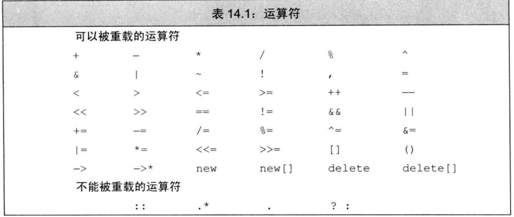
2.自增自减运算符
```cpp
//前置
F operator++(){
    //检查是否到尾部了，无法递增了
    check()
    ++*this
    return this;
}
//后置
F operator++(int){
    F ret = *this
    ++*this
    return ret;
}
```
3.重载类型转换
避免过度使用类型转换
```cpp
//显示转换
F explicit operator int(){

    return val;
}
F  operator int(){

    return val;
}
F ff;
static_cast<int>(ff);
```

## 14 IO库(看的似是而非)
### 14.1 IO类
1.头文件
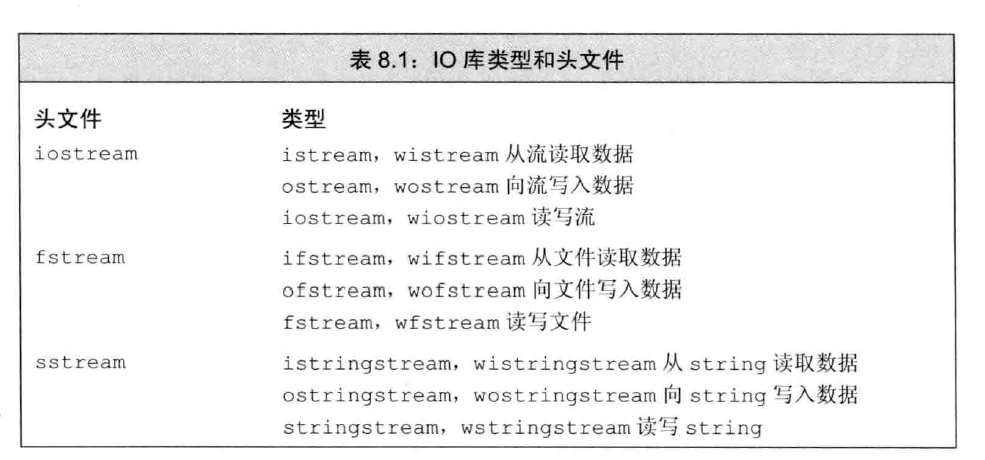
2.条件状态
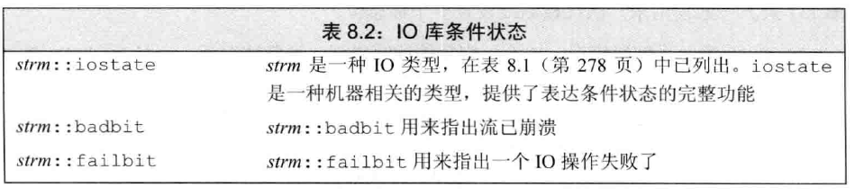
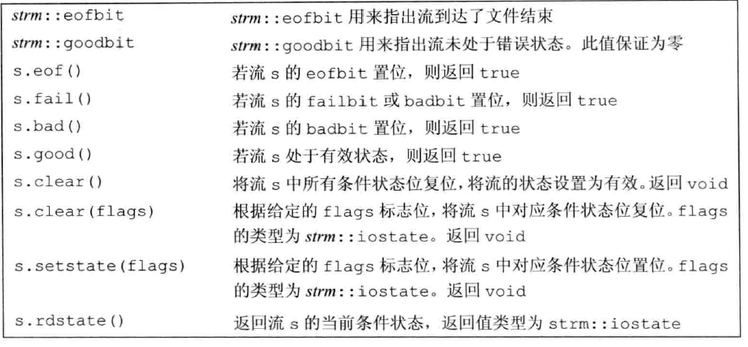

Q:编写函数，接受一个istream &参数，返回值也是istream&。此函数必须从给定流中读取数据，直至遇到文件结束标识符时停止。它将读取的数据打印在标准输出上。完成这些操作后，在返回流之前，对流进行复位，使其处于有效状态
```cpp
istream& read(istream &is){
    string word;
    while(is >> word){
        cout << word;
    }
    is.clear();//清除
    return is;
}
```
3.输出刷新缓存区
```cpp
os << endl;//换行并刷新缓存区
os << flush;//刷新缓存区
os << ends;//输出一个空字符并刷新缓存区
os << unitbuf;//每次输出后刷新缓存区
os << nounitbuf;//正常的缓存结构
```
注：程序崩溃后缓存区不会刷新

### 14.2.文件输入输出
1.fstream操作
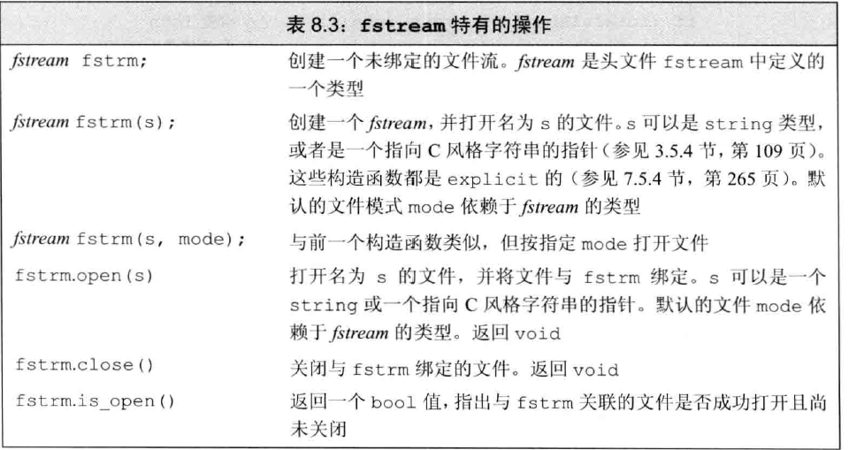
```cpp
int main(){
    ifstream fin("MYC++//eposide_14//test.txt");
    vector<string> lines;
    vector<string> words;
    if(!fin){//如果无法打开
        cout << "Can't open the file"<<endl;
    }
    // string line;
    // while(getline(fin,line)){
    //     lines.push_back(line);
    // }
    string word;
    while(fin>>word){
        words.push_back(word);
    }
    fin.close();

    // vector<string>::const_iterator it = lines.begin();
	// while (it!=lines.end())
	// {
	// 	cout << *it << endl;
	// 	++it;
	// }

    vector<string>::const_iterator it1 = words.begin();
    while (it1!=words.end())
	{
		cout << *it1 << endl;
		++it1;
	}

    system("pause");
    return 0;
}
```

2.文件模式
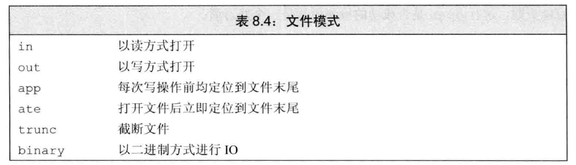

### 14.3 string流
1.操作
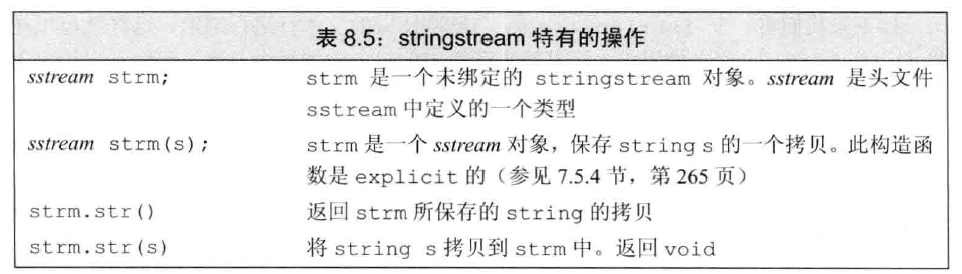

## 15.泛型算法(仔细应该看看STL)
### 15.1.只读算法
只读取值但不会改变值
```cpp
accumulate();//求和算法，返回int
equal();//比较两个是否相等
```
### 15.2.写算法
```cpp
fill(v.begin(),v.end(),0);//填充0
fill_n(v.begin(),v.end(),0);//填充0
fill_n(p,n,num);//在p指向的n个开始填充
auto it = back_insert(vec);//返回一个指向vec的迭代器
*it = 42;//vec赋值42

copy(begin(a),end(a),b)；//a开始到结束拷贝给b

sort();//排序算法
stable_sort();//用于排序中有相等的元素？？

```

### 15.3.lamda表达式
1.lamda
```cpp
sort(a.begin(),a.end,[](const string &a,const string &b){
    return a.size(),b.size()
})

[sz](const string &a,const string &b){
    return a.size()>sz;//接收参数
})


int main(int argc, char* argv[])
{
    int a = 5,b = 6;
    auto c = [a,b]{ return a+b; };
    auto d = [](int m,int n){ return m+n; }(a,b);
    auto e = [](int m,int n){ return m+n; };
    cout << c()<<endl;//11
    cout << d <<endl;//11
    cout << e(a,b) <<endl;//11
    system("pause");
    return 0;
}
```

2.lamda捕获
```cpp
//值捕获
int val = 42;
auto f = [val]{return val};
val = 0;
auto j = f();//j为42；

//引用捕获
int val = 42;
auto f = [&val]{return val};
val = 0;
auto j = f();//j为0；

//隐式捕获
//捕获第一个使用=
[=](const string &a,const string &b){
    return a.size()>=sz;//接收参数
})
```

3.可变lamda
```cpp
//指定返回int
[](int i)->int{i>0?i:-i};//不指定会返回int
```

### 15.4.bind函数
auto newCallable = bind(callable, arg_list);
bind函数看做一个通用的函数适配器，它接受一个可调用对象callable，生成一个新的可调用对象newCallable。它可以把原可调用对象callable的某些参数预先绑定到给定的变量中（也叫参数绑定），然后产生一个新的可调用对象newCallable。
```cpp
#include <iostream>
#include <memory>
#include <functional>

using namespace std::placeholders;
using namespace std;

void fun1(int n1, int n2, int n3)
{
    cout << n1 << " " << n2 << " " << n3 << endl;
}

int main()
{
    //_1表示这个位置是新的可调用对象的第一个参数的位置
    //_2表示这个位置是新的可调用对象的第二个参数的位置  
    auto f1 = bind(fun1, _2, 22, _1);
    f1(44,55);//输出 55 22 44
}
```


## 16.内存管理
### 16.1.智能指针
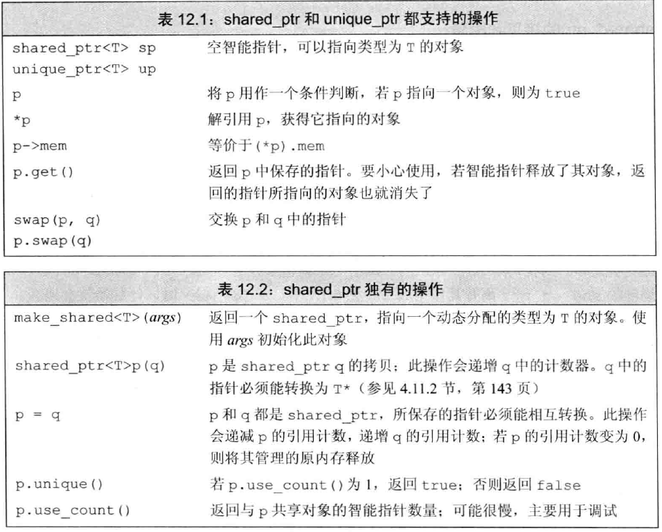
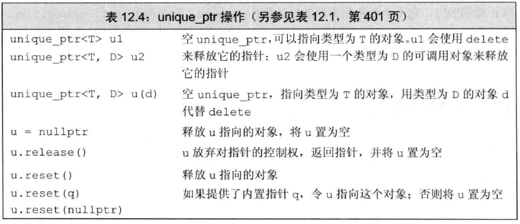
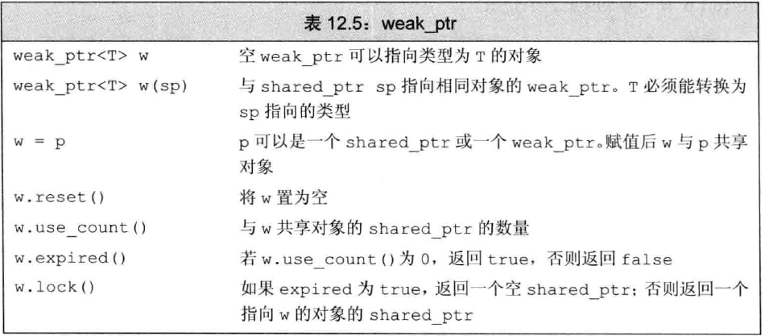
shared_ptr允许多个指针指向同一个对象
unique_ptr独占指向的对象
weak_ptr必须用shared_ptr初始化
```cpp
auto p = make_shared<int>(42);
weak_ptr<int> wp(p);
```


### 16.2.直接管理内存
1.new与delete
```cpp
int *p = new int;//指向一个没有初始化的int
int *p = new int(1024);//p指向的值为1024
int *p = new int();//p指向的值初始化为0
const int*p = new int(1024);//const必须初始化
delete p;//释放动态内存，只能释放new的
int q=new int(42),*r=new int(100);
r=q;//r指向q，使得r原先分配的内存无法释放
auto q2=make_shared<int>(42),rw=make_shared<int>(100);
r2=q2;//r2是智能指针，可以释放
```

注意：在new和delete之间如果发生异常但没被捕获，可能内存一直没有释放


2.new与智能指针
```cpp
shaerd_ptr<int> p = new int(42);//错误
shaerd_ptr<int> p(new int(42));//p指向42的值
```
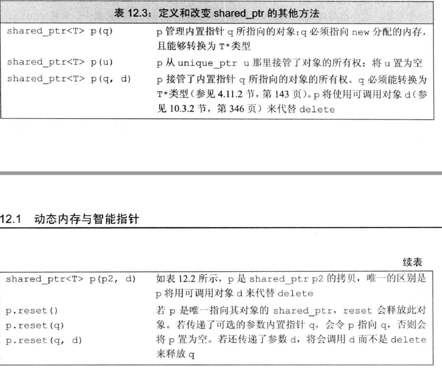

### 16.3.动态数组
1.new与数组
```cpp
int *pia = new int[get_size()];//通过get_size()确定大小，pia指向数组首元素

typedef int arrT[42];
int *p = new arrT;//表示分配一个42大
小的数组
int *p = new int[10];//分配10个未初始化的int
int *p = new int[10]();//分配10个0
string *p = new string[10];//10个空的string
string *p = new string[10]();//10个空的string

int *p = new int[10]{1,2,3...};//初始化为1，2，


//动态数组的释放
delete [] p;
```
注：动态数组不支持begin(),end();

2.动态数组与智能指针
```cpp
unique_ptr<int []> up(new int [10]);
up[i];//unique_ptr指向数组时候不能用.或者->

up.release();//销毁指针
```
注意：share_ptr不支持指向动态数组
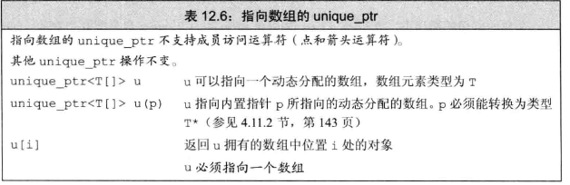

3.allocator
定义在头文件menory中
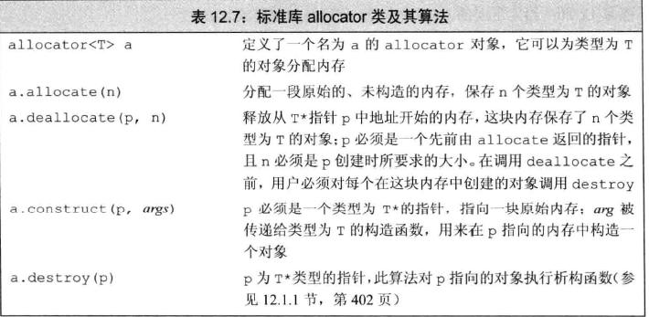
```cpp
auto q = p;//q指向最后构造的元素之后
alloc.construct(q++)//*q为空
alloc.construct(q++,10,'c')//*q为cccccccccc
alloc.construct(q++,"hi")//*q为hi

cout << *p;//正确
cout << *q;//灾难

//释放内存
while(q!=p)
alloc.destroy(--q);
```


## 17.面向对象的编程
### 17.1继承
基类
```cpp
//定义基类
class Quote {
public:
    Quote() = default;
    Quote(string const& b, double p) : bookNo(b), price(p) { }
 
    string isbn() const { return bookNo; }
    virtual double net_price(size_t n) const { return n * price; }//对于希望派生类自己定义方法的可以声明为虚函数
 
    virtual ~Quote() = default;
private:
    string bookNo;
protected:
    double price = 0.0;
};
 
double print_total(ostream& os, Quote const& item, size_t n) {
    double ret = item.net_price(n);
    os << "ISBN: " << item.isbn() << " # sold: " << n << " total due: " << ret << endl;
    return ret;
}
```
派生类
```cpp
class Bulk_quote : public Quote {
public:
    Bulk_quote() = default;
    Bulk_quote(string const& book, double p, size_t qty, double disc) : Quote(book, p), min_qty(qty), discount(disc) {}
 
    double net_price(size_t cnt) const override {//派生类覆盖基类的虚函数需要override，且形参列表必须与基类相同
        if (cnt >= min_qty) return cnt * (1 - discount) * price;
        else return cnt * price;
    }
protected:
    size_t min_qty = 0;
    double discount = 0.0;
};
```
基类与派生类的转换
```cpp
Quote item;
Bulk_quote bulk;
Quote *p =&item;
p = &bulk;//p指向bulk的Quote部分
Quote r = &bulk;//r指向bulk的Quote部分

Bulk_quote *q = &item;//错误，不存在基类向派生类的转换

```
派生类可以继承基类中的成员，但派生类可以访问基类的公有成员而不能访问私有成员。
如果希望派生类能访问基类私有成员但不能被其他类访问可以使用protect
派生类的成员可以访问基类的静态成员
派生类的声明不能包含派生列表
当作基类的类必须定义


防止继承，在类的后面加 final
```cpp
class  F final{};//F不能作为基类
```

### 17.2虚函数
1.概念
很多概念上一章提到了
2.final
将函数定义为final，派生类不能重写

### 17.3抽象基类
1.纯虚函数
在函数后面加个 " =0 ",表示纯虚函数，即不做任何定义，但是纯虚函数也是可以有函数体的，必须在类的外部定义。
2.抽象基类
含有纯虚函数的类叫做抽象基类，抽象基类负责定义结构，后续其他类负责覆盖接口

### 17.4友元与继承
当一个类将另一个声明为友元时，友元类对这个类有特殊访问权限，但友元的基类和派生类没有，友元不能继承

### 17.5改变类的访问权限

通过using改变成员的可访问性
```cpp
class F{
    public:
        int size();
    protected:
        int n;
}

class S :private F{
    public:
        using F::size;
    protected:
        using F::n
}

```

### 17.6作用域

1，名字查找优于类型查找
```cpp
class F{
    public:
        int size();
}

class S :private F{
    public:
        int size(int);
}
F f,S s;
f.size();//正确
s.size(10);//正确
s.size();//错误，查找到了函数名字就停止了
s.F::size();//所以使用作用域
```

2.虚函数和作用域
```cpp
class F{
    public:
        virtual int size();
}

class S:public F{
    public:
        int size(int);//形参列表与F不一样
        virtual void f();
}

class G:public S{
    public:
        int size(int);//非虚函数，隐藏了S：：size()
        int size();//覆盖了F的size
        void f();//覆盖了S的f
}
//通过基类调用虚函数
F f,S s ,G g;
F *p1 = &f,F *p2 = &s, F* p3 = &g;
p1->size();//F
p2->size();//F
p3->size();//G

S *p4 = &s,S* p5 =&g
p2->f();//错误，F里面没有f
p4->f();//S
p5->f();//G
```


### 17.7构造与拷贝控制
1.虚析构函数
我们需要删除一个指向派生类对象的基类指针，需要虚析构函数
```cpp
class F{
    public:
        virtual ~F() = default;
}
```

2.派生类的构造赋值函数
```cpp
class S:public F{
    //赋值一些基类的属性
    S(const S&s):F(s){}
    S(S &&s):F(std::move(s)){} 
    S operator=(const S &s){
        F::operator=(s);//为基类部分赋值
        //为派生了成员赋值

        return *this;
    }
}
```

### 17.8容器和继承
```cpp
vector<F> fv;
fv.push_back(F(1));//正确
fv.push_back(S(1));//调用基类的部分，派生类部分将会忽略
```

## 18.模板与泛型编程
### 18.1.定义模板
```cpp
template <typename T>
int compare(const T &v1,const T&v2){
    if(v1 < v2) return -1;
    if(v1 > v2) return 1;
    return 0;
}

compare(1,0);
compare(v1,v2);//v1,v2都是vector<int>

template <typename T1,typename T2>
T1 fun(const T1 &v1,const T2&v2){
    //
}
```
当模板编译的时候，并不生成代码。只有当我们实例化出模板的一个特定版本时候，编译器才会生成代码

当然模板可以先声明后定义
```cpp
template <typename T> int compare(const T &v1,const T&v2);
```
当遇到extern模板声明时，他不会在本文件中生成实例化代码
```cpp
extern template <typename T> int compare(const T &v1,const T&v2);
```


### 18.2.类模板
1.定义类模板
```cpp
template <typename T> bool operator==(const Blob<T>&, const Blob<T>&);
template <typename T> bool operator!=(const Blob<T>&, const Blob<T>&);
template <typename T> bool operator<(const Blob<T>&, const Blob<T>&);
template <typename T> bool operator>(const Blob<T>&, const Blob<T>&);
template <typename T> bool operator<=(const Blob<T>&, const Blob<T>&);
template <typename T> bool operator>=(const Blob<T>&, const Blob<T>&);

template <typename T> class Blob {
    friend class ConstBlobPtr<T>;
    friend class BlobPtr<T>;
    friend bool operator==<T>(const Blob<T>&, const Blob<T>&);
    friend bool operator!=<T>(const Blob<T>&, const Blob<T>&);
    // clang-format off
    friend bool operator< <T>(const Blob<T>&, const Blob<T>&);
    friend bool operator> <T>(const Blob<T>&, const Blob<T>&);
    // clang-format on
    friend bool operator<=<T>(const Blob<T>&, const Blob<T>&);
    friend bool operator>=<T>(const Blob<T>&, const Blob<T>&);

public:
    typedef typename vector<T>::size_type size_type;

    Blob() : data(make_shared<vector<T>>()) {}
    Blob(initializer_list<T> il) : data(make_shared<vector<T>>(il)) {}

    Blob(const Blob<T>& lhs) : data(make_shared<vector<T>>(*lhs.data)) {}
    Blob& operator=(const Blob<T>&);

    Blob(Blob<T>&& rhs) NOEXCEPT : data(std::move(rhs.data)) {}
    Blob& operator=(Blob<T>&&) NOEXCEPT;

    BlobPtr<T> begin();
    BlobPtr<T> end();

    ConstBlobPtr<T> cbegin() const;
    ConstBlobPtr<T> cend() const;

    T& operator[](size_t n);
    const T& operator[](size_t n) const;

    size_type size() const { return data->size(); }
    bool empty() const { return data->empty(); }

    void push_back(const T& t) { data->push_back(t); }
    void push_back(T&& s) { data->push_back(std::move(s)); }

    void pop_back();
    T& front();
    T& back();
    const T& front() const;
    const T& back() const;

private:
    void check(size_type, const T&) const;

    shared_ptr<vector<T>> data;
};
```

2.实例化
```cpp
Blob<int> ia;
Blob<int> ia2 = {0,1,2,3,4}
```

3.类模板外定义成员和构造函数
在类内定义就不需要再次template <typename T>
```cpp
template <typename T> Blob<T>& Blob<T>::operator=(const Blob<T>& lhs)
{
    data = make_shared<vector<T>>(*lhs.data);
    return *this;
}
```

4.与友元的关系
友元需要前置声明，像1.cpp里面开头那样


5.类模板里面的静态成员
```cpp
#include <iostream>
using namespace std;
template <class T>
class A
{
private:
    static int count;
public:
    A() { count ++; }
    ~A() { count -- ; };
    A(A &) { count ++ ; }
    static void PrintCount() { cout << count << endl; }
};
template<> int A<int>::count = 0;
template<> int A<double>::count = 0;
int main()
{
    A<int> ia;
    A<double> da;
    ia.PrintCount();
    da.PrintCount();
    return 0;
}
```


```
程序的输出结果是：
1
1

A<int> 和 A<double> 是两个不同的类。虽然它们都有静态成员变量 count，但是显然，A<int> 的对象 ia 和 A<double> 的对象 da 不会共享一份 count。
```


