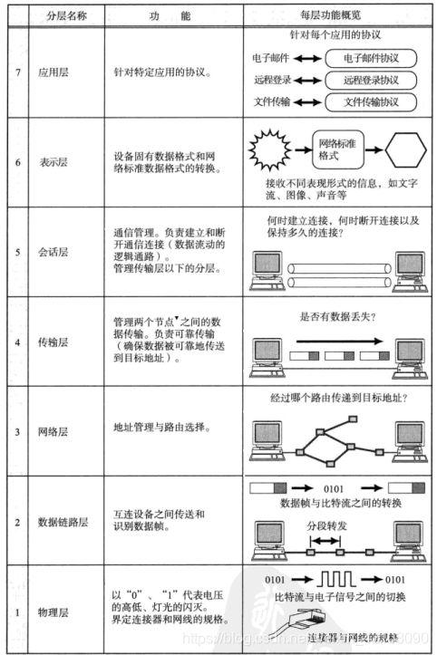

# 计算机网络
## 协议
### 定义
计算机之间通过网络实现通信时事先达成的一种约定

## OSI参考模型
### OSI分层

- 7 应用层
为程序提供服务并规定应用程序中通信的相关细节，包括文件传输，电子邮件，远程登陆
- 6 表示层
将应用层信息转化为合适的网络传输格式，或者将下一层的数据转化为上层能够处理的格式
- 5 会话层
负责建立和断开通信连接，以及数据的分割等数据传输相关的管理
- 4 传输层
起着可靠的传输作用，只在通信双方节点上进行处理，而无需再路由器上进行处理
- 3 网络层
将数据传输到目标地址。目标地址可以是多个网络通过路由器连接而成的某一个地址。因此这一层主要负责寻址和路由选择。
- 2 数据链路层
负责物理层面上互连的、节点之间的通信传输。例如与1个以太网相连的2个节点之间的通信。
将0、1序列划分为具有意义的数据帧传送给对端（数据帧的生成与接收）。
- 1 物理层
负责0、1比特流（0、1序列）与电压的高低、光的闪灭之间的互换。

## 传输方式
### 面向有连接与面向无连接
- 面向有连接:在发送数据前，需要在首发主机之间连接一条通信线路，例如打电话
- 面向无连接：不要求建立和断开连接，可以自由发送数据，同时，自己也不知道何时收到数据，接收端需要确认是否收到数据。例如邮局发包裹
### 电路交换与分组交换
- 电路交换：两条电路、最多只能有两个用户同时通信。交换机主要负责数据的中转处理。建立好连接以后，用户就可以一直使用这条电路，直到该连接被断开为止
- 分组交换：1条通信线路(线路共享)、通过线路共享可以让3个用户同时通信。让连接到通信电路的计算机将所要发送的数据分成多个数据包，按照一定的顺序排列之后分别发送。分组交换的大致过程是：发送端计算机将数据分组发送给路由器，路由器收到这些分组以后，缓存到自己的缓冲区，然后再转发给目标计算机。路由器接收到数据以后会按照顺序缓存到相应的队列当中，再以先进先出的顺序将它们逐一发送出去。
### 根据接收端数量分类、
- 单播：1对1通信，如电话
- 广播：1对多
- 多播：1对指定的多
- 任播：组内任意一台作为接收机

## 地址
- 1.唯一性
- 2.层次性：例如IP地址由网络号和主机号决定

## 网络构成要素
- 1.通信媒介和数据链路：以太网，电缆等
- 2.网卡：是计算机连网的设备
- 3.中继器：从物理层上延长网络的设备，如Hub
- 4.网桥/2层交换机：从数据链路层上延长网络的设备
- 5.路由器/3层交换机：连接网络与网络的设备，将分组报文发送给另一个目标路由器，可以连接任意两个数据链路层。
对应OSI模型第3层
- 6.4~7层路由器(负责均衡器)：负责处理OSI模型中从传输层到应用层的数据，向多个服务器分散压力
- 7.网关：负责协议的转化和数据的转发，是OSI模型中负责传输层到应用层的数据进行转化和转发的设备