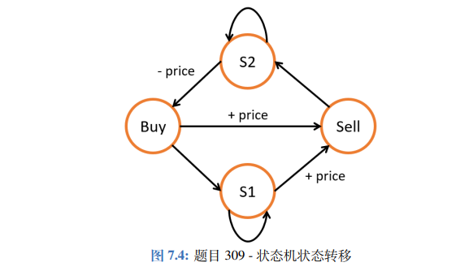

## 一维
### 70 爬梯子
假设你正在爬楼梯。需要 n 阶你才能到达楼顶。每次你可以爬 1 或 2 个台阶。你有多少种不同的方法可以爬到楼顶呢

建立转移方程 y[n] = y[n-1]+y[n-2]
```cpp
class Solution {
public:
    int climbStairs(int n) {
        if(n<=2) return n;
        int pre = 1,last = 2,cur;
        int tmp;
        for(int i = 2;i<n;i++){
            cur = pre+last;
            pre = last;
            last = cur;
        }
        return cur;
    }
};
```

## 分治
### 91. 解码方法
思路：画图去理解吧
```cpp
class Solution {
public:
    int numDecodings(string s) {
        int n = s.length();
        if(n == 0) return 0;
        int prev = s[0] - '0';
        if(!prev) return 0;
        if(n == 1)return 1;
        vector<int> dp(n+1,1);
        for(int i = 2;i<=n;++i){
            int cur = s[i-1]-'0';
            //无法解码的
            if((prev == 0||prev>2)&&cur == 0)
                return 0;
            
            if((prev<2&&prev>0)||prev == 2&&cur<7){
                if(cur){
                    //可以自己画图推导一下
                    dp[i] = dp[i-2]+dp[i-1];
                }
                else{
                    //画图推到
                    dp[i] = dp[i-2];
                }
            }
            else 
                dp[i] = dp[i-1];
            prev = cur;
        }
        return dp[n];
    }
};
```

## 子序列(leetcode里面子序列不要求连续的)
### 300. 最长递增子序列
```cpp
class Solution {
public:
    int lengthOfLIS(vector<int>& nums) {
        //leetcode里面子序列不要求连续
        int max_lenght = 0;
        int n = nums.size();
        if(n<=1) return n;
        vector<int> dp(n,1);
        for(int i = 0;i<n;i++){
            for(int j = 0;j<i;j++){
                if(nums[i]>nums[j]){
                    dp[i] = max(dp[i],dp[j]+1);
                }
            }
            max_lenght = max(max_lenght,dp[i]);
        }
        return max_lenght;
    }
};
```
```cpp
class Solution {
public:
    int lengthOfLIS(vector<int>& nums) {
        int n = nums.size();
        if(n<=1) return n;
        vector<int> dp;
        dp.push_back(nums[0]);
        for(int i = 1;i<n;i++){
            if(dp.back() < nums[i])
                dp.push_back(nums[i]);
            else{
                auto it = lower_bound(dp.begin(),dp.end(),nums[i]);//找到第一个大于等于的值
                *it = nums[i];
            }

        }
        return dp.size();
    }
};
```

### 1143. 最长公共子序列
给定两个字符串 text1 和 text2，返回这两个字符串的最长 公共子序列 的长度。如果不存在 公共子序列 ，返回 0 。

一个字符串的 子序列 是指这样一个新的字符串：它是由原字符串在不改变字符的相对顺序的情况下删除某些字符（也可以不删除任何字符）后组成的新字符串。

例如，"ace" 是 "abcde" 的子序列，但 "aec" 不是 "abcde" 的子序列。
两个字符串的 公共子序列 是这两个字符串所共同拥有的子序列。

```cpp
class Solution {
public:
    int longestCommonSubsequence(string text1, string text2) {
        int m = text1.length();
        int n = text2.length();
        vector<vector<int>> dp(m+1,vector<int>(n+1,0));
        for(int i = 1;i<=m;i++){
            for(int j = 1;j<=n;j++){
                if(text1[i-1] == text2[j-1])
                    dp[i][j] = dp[i-1][j-1]+1;
                else
                    dp[i][j] = max(dp[i-1][j],dp[i][j-1]);
            }
        }
        return dp[m][n];
    }
};
```

## 背包问题
```cpp

/**
0-1背包物品，每个物品只能拿一个
dp[i][j] 表示前 i 件物品体积不超过 j 的情况下能达到的最大价值。在我们遍历到第 i 件物品时，在当前背包总量为 j 的情况下，如果我们不将物品 i 放入背包，那么 dp[i][j]= dp[i-1][j]，即前 i 个物品的最大价值等于只前 i-1 个物品时的最大价值；如果我们将物品 i 放入背包，假设第 i 件物品体积为 w，价值为 v，那么我们得到 dp[i][j] = dp[i-1][j-w] + v。我们只需在遍历过程中对这两种情况取最大值即可，
*/
int knapsack(vector<int> weights, vector<int> values, int N, int W) {
    vector<vector<int>> dp(N + 1, vector<int>(W + 1, 0));
    for (int i = 1; i <= N; ++i) {
        int w = weights[i-1], v = values[i-1];
        for (int j = 1; j <= W; ++j) {
            if (j >= w) {
                dp[i][j] = max(dp[i-1][j], dp[i-1][j-w] + v);
            } 
            else{
                dp[i][j] = dp[i-1][j];
            }
        }
    }
    return dp[N][W];
}
/*
我们可以进一步对 0-1 背包进行空间优化，将空间复杂度降低为 O(W)。
假设我们目前考虑物品 i = 2，且其体积为 w = 2，价值为 v = 3；
对于背包容量 j，我们可以得到 dp[2][j]= max(dp[1][j], dp[1][j-2] + 3。
这里可以发现我们永远只依赖于上一排 i = 1 的信息，
之前算过的其他物品都不需要再使用。因此我们可以去掉 dp 矩阵第一个维度，
在考虑物品 i 时变成 dp[j]= max(dp[j], dp[j-w] + v)。
这里要注意我们在遍历每一行的时候必须逆向历，
这样才能够调用上一行物品 i-1 时 dp[j-w] 的值；
若按照从左往右的顺序进行正向遍历，
则 dp[j-w] 的值在遍历到j 之前就已经被更新成物品 i 的值了。
*/


int knapsack(vector<int> weights, vector<int> values, int N, int W) {
    vector<int> dp(W + 1, 0);
    for (int i = 1; i <= N; ++i) {
        int w = weights[i-1], v = values[i-1];
        for (int j = W; j >= w; --j) {
            dp[j] = max(dp[j], dp[j-w] + v);
        }
    }
    return dp[W];
}

完全背包问题中，一个物品可以拿多次。
int knapsack(vector<int> weights, vector<int> values, int N, int W) {
    vector<vector<int>> dp(N + 1, vector<int>(W + 1, 0));
    for (int i = 1; i <= N; ++i) {
        int w = weights[i-1], v = values[i-1];
        for (int j = 1; j <= W; ++j) {
            if (j >= w) {
                dp[i][j] = max(dp[i-1][j], dp[i][j-w] + v);
            } 
            else{
                dp[i][j] = dp[i-1][j];
            }
        }
    }
    return dp[N][W];
}
/*压缩空间后*/
int knapsack(vector<int> weights, vector<int> values, int N, int W) {
    vector<int> dp(W + 1, 0);
    for (int i = 1; i <= N; ++i) {
        int w = weights[i-1], v = values[i-1];
        for (int j = w; j <= W; ++j) {
            dp[j] = max(dp[j], dp[j-w] + v);
        }
    }
return dp[W];
}
```


### 322. 零钱兑换
给你一个整数数组 coins ，表示不同面额的硬币；以及一个整数 amount ，表示总金额。

计算并返回可以凑成总金额所需的 最少的硬币个数 。如果没有任何一种硬币组合能组成总金额，返回 -1 。

你可以认为每种硬币的数量是无限的。

```
class Solution {
public:
    int coinChange(vector<int>& coins, int amount) {
        vector<int> dp(amount+1,amount+2);
        dp[0] = 0;
        for(int i = 1;i<=amount;++i){
            for(int coin:coins){
                if(i>=coin){
                    dp[i] = min(dp[i],dp[i-coin]+1);
                }
            }
        }
        return dp[amount] == amount+2?-1:dp[amount];
    }
};
```

### 416. 分割等和子集
```cpp
class Solution {
public:
    bool canPartition(vector<int>& nums) {
        int sum = accumulate(nums.begin(),nums.end(),0);
        if(sum%2) return false;

        int target = sum/2;
        int n = nums.size();
        vector<vector<bool>> dp(n+1,vector<bool>(target+1,false));
        for(int i = 0;i<=n;i++){
            dp[i][0] = true;
        }
        for(int i = 1;i<=n;i++){
            for(int j = 1;j<=target;j++){
                if(j>=nums[i-1])
                    dp[i][j] = (dp[i-1][j]||dp[i-1][j-nums[i-1]]);//如果我上一个能达到，这个也能达到
                else
                    dp[i][j] = dp[i-1][j];
            }
        }
       // return true;
        return dp[n][target];
    }
};
```
### 474 一和零
```cpp
class Solution {
public:
    pair<int,int> count(const string &str){
        int count0 = str.length();
        int count1 = 0;
        for(const char&c :str){
            if(c == '1'){
                count0--;
                count1++;
            }
        }
        return make_pair(count0,count1);
    }
    int findMaxForm(vector<string>& strs, int m, int n) {
        vector<vector<int>> dp(m+1,vector<int>(n+1,0));
        for(const string & str:strs){
            auto[count0,count1] = count(str);
            for(int i = m;i>=count0;i--){
                for(int j = n;j>=count1;j--){
                    dp[i][j]=max(dp[i][j],1+dp[i-count0][j-count1]);
                }
            }
        }
        return dp[m][n];
    }
};
```

## 字符串编辑
### 72. 编辑距离
```
给你两个单词 word1 和 word2，请你计算出将 word1 转换成 word2 所使用的最少操作数 。

你可以对一个单词进行如下三种操作：

插入一个字符
删除一个字符
替换一个字符
 
输入：word1 = "horse", word2 = "ros"
输出：3
解释：
horse -> rorse (将 'h' 替换为 'r')
rorse -> rose (删除 'r')
rose -> ros (删除 'e')

来源：力扣（LeetCode）
链接：https://leetcode-cn.com/problems/edit-distance
著作权归领扣网络所有。商业转载请联系官方授权，非商业转载请注明出处。
```
```cpp
class Solution {
public:
    int minDistance(string word1, string word2) {
        int m = word1.length();
        int n = word2.length();
        vector<vector<int>> dp(m+1,vector(n+1,0));
        for(int i = 0;i<=m;i++){
            for(int j = 0;j<=n;j++){
                if(i == 0 ){
                    dp[i][j] = j; 
                }
                else if(j == 0){
                    dp[i][j] = i;
                }
                else{
                    dp[i][j] = min((dp[i-1][j-1]+(word1[i-1]==word2[j-1]?0:1)),min(dp[i-1][j]+1,dp[i][j-1]+1));
                }
            }
        }
        return dp[m][n];
    }
    
};
```
### 650. 只有两个键的键盘
给定一个字母 A，已知你可以每次选择复制全部字符，或者粘贴之前复制的字符，求最少需
要几次操作可以把字符串延展到指定长度。
```cpp
class Solution {
public:
/*
不同于以往通过加减实现的动态规划，这里需要乘除法来计算位置，因为粘贴操作是倍数增
加的。我们使用一个一维数组 dp，其中位置 i 表示延展到长度 i 的最少操作次数。对于每个位置
j，如果 j 可以被 i 整除，那么长度 i 就可以由长度 j 操作得到，其操作次数等价于把一个长度为 1
的 A 延展到长度为 i/j。因此我们可以得到递推公式 dp[i] = dp[j] + dp[i/j]。
*/
    int minSteps(int n) {
        vector<int> dp(n+1);
        int h = sqrt(n);
        for(int i = 2;i<=n;i++){
            dp[i] = i;
            for(int j = 2;j<=h;j++){
                if(i%j == 0){
                    dp[i] = dp[j]+dp[i/j];//长度j扩展到i相当于依次1扩展到i/j
                    break;
                }
            }
        }
    return dp[n];
    }
};
```

## 股票问题
### 122.买卖股票的最佳时机 II
```cpp
class Solution {
public:
    int maxProfit(vector<int>& prices) {
        int n = prices.size();
        vector<int> hold(n+1,0);//第i天不卖当前股票的收益
        vector<int> sell(n+1,0);//第i天卖掉当前股票的收益
        for(int i = 1;i<=prices.size();i++){
            if(i == 1){
                hold[i] = -prices[0];
                sell[i] = 0;
            }
            else{
                hold[i] = max(hold[i-1],sell[i-1]-prices[i-1]);
                sell[i] = max(sell[i-1],prices[i-1]+hold[i-1]);
            }
        }
        return sell[n];       
    }
};

//空间压缩：由于当前状态只与前一个状态有关，所以可以空间压缩
class Solution {
public:
    int maxProfit(vector<int>& prices) {
        int n = prices.size();
        int hold = 0,sell = 0;
        // vector<int> hold(n+1,0);//第i天不卖当前股票的收益
        // vector<int> sell(n+1,0);//第i天卖掉当前股票的收益
        for(int i = 1;i<=prices.size();i++){
            if(i == 1){
                hold= -prices[0];
                sell= 0;
            }
            else{
                hold= max(hold,sell-prices[i-1]);
                sell= max(sell,prices[i-1]+hold);
            }
        }
        return sell;       
    }
};
```

### 188. 买卖股票的最佳时机 IV
给定一个整数数组 prices ，它的第 i 个元素 prices[i] 是一支给定的股票在第 i 天的价格。

设计一个算法来计算你所能获取的最大利润。你最多可以完成 k 笔交易。

注意：你不能同时参与多笔交易（你必须在再次购买前出售掉之前的股票）。

来源：力扣（LeetCode）
链接：https://leetcode-cn.com/problems/best-time-to-buy-and-sell-stock-iv
著作权归领扣网络所有。商业转载请联系官方授权，非商业转载请注明出处。
```cpp
class Solution {
public:
    int maxProfit(vector<int>& prices){
        int maxProfit = 0;
        for(int i = 1;i<prices.size();++i){
            if(prices[i]>prices[i-1]){
                //有的赚就卖
                //详见贪心算法
                maxProfit += prices[i]-prices[i-1];
            }
        }
        return maxProfit;
    }
    int maxProfit(int k, vector<int>& prices){
        int days = prices.size();
        if(days < 2){
            return 0;
        }

        if(k>=days){
            return maxProfit(prices);
        }
//buy[j] 表示在第 j 次买入时的最大收益,sell[j] 表示在第 j 次卖出时的最大收益
        vector<int> buy(k+1,INT_MIN),sell(k+1,0);
        for(int i = 0;i<days;++i){
            for(int j = 1;j<=k;++j){
                buy[j] = max(buy[j],sell[j-1]-prices[i]);//收益减去当前的价格
                sell[j] = max(sell[j],buy[j]+prices[i]);
            }
        }
        return sell[k];
    }
};
```
### 309. 最佳买卖股票时机含冷冻期
 给定一段时间内每天的股票价格，已知每次卖出之后必须冷却一天，且每次只能拥有一支股票，求最大的收益。

图片来自《LeetCode 101 - A LeetCode Grinding Guide (C++ Version》
```cpp
class Solution {
public:
    int maxProfit(vector<int>& prices) {
        int n = prices.size();
        if(n == 0) return 0;
        vector<int> buy(n),sell(n),s1(n),s2(n);
        s1[0] = buy[0] = -prices[0];
        sell[0] = s2[0] = 0;
        //画个状态机吧。。。
        for(int i = 1;i<n;i++){
            buy[i] = s2[i-1]-prices[i];
            s1[i] = max(buy[i-1],s1[i-1]);
            sell[i] = max(buy[i-1],s1[i-1])+prices[i];
            s2[i] = max(s2[i-1],sell[i-1]);
        }
        return max(sell[n-1],s2[n-1]);
    }
};
```
## 其他
### 338. 比特位计数
给你一个整数 n ，对于 0 <= i <= n 中的每个 i ，计算其二进制表示中 1 的个数 ，返回一个长度为 n + 1 的数组 ans 作为答案。

```cpp
class Solution {
public:
    vector<int> countBits(int n) {
        //利用动态规划
        //如果一个数末尾是1，则他含1的个数为dp[i-1]
        //如果是0，则是dp[i>>1]
        vector<int> dp(n+1,0);
        for(int i = 1;i<=n;++i){
            dp[i] = i&1?dp[i-1]+1:dp[i>>1];
        }
        return dp;
    }
};
```

### 918 猫和老鼠
```cpp
class Solution {
public:
    int dp[51][51][51*2];
    int catMouseGame(vector<vector<int>>& graph) {
        int n = graph.size();
        memset(dp,-1,sizeof(dp));
        return getResult(1,2,0,graph);
    }

    int getResult(int mouse,int cat,int turn,vector<vector<int>>& graph){
        if(turn == graph.size()*2)
            return 0;//平局
        if(dp[mouse][cat][turn]<0)
            if(mouse == 0)
                dp[mouse][cat][turn] = 1;            
            else if(mouse == cat)
                dp[mouse][cat][turn] = 2;
            else
                getNext(mouse,cat,turn,graph);
        return dp[mouse][cat][turn];
    }

    void getNext(int mouse,int cat,int turn,vector<vector<int>>& graph){
        int curMove = turn%2 == 0 ?mouse:cat;

        int defaultResult = curMove == mouse?2:1;
        int result = defaultResult;

        for(int &next:graph[curMove]){
            if(curMove == cat && next == 0)
                continue;
            int nextMouse = curMove==mouse?next:mouse;
            int nextCat = curMove == cat?next:cat;
            int nextresult = getResult(nextMouse,nextCat,turn+1,graph);
            if(nextresult != defaultResult){
                result = nextresult;
                if(result!= 0)
                    break;    
            }
        }
        dp[mouse][cat][turn] = result;
    }
};
```