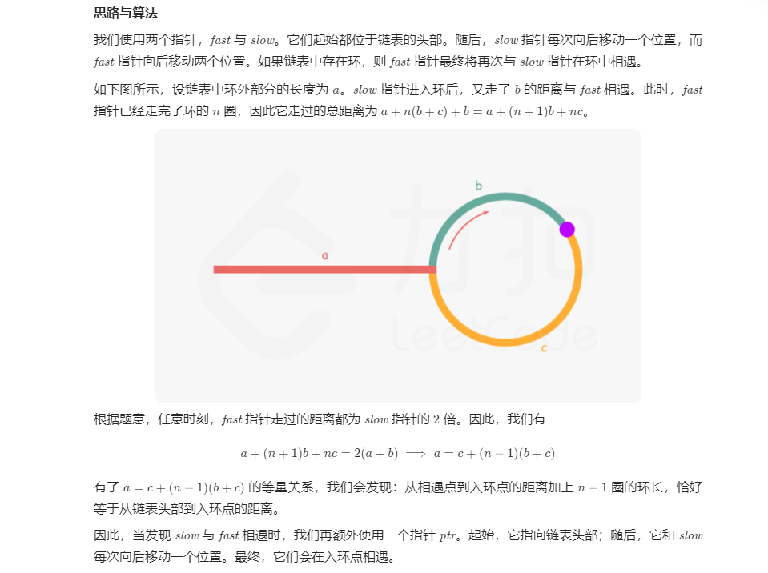

# 双指针法

## 快慢指针(E)
1.适合查有序列表重复项
2.适合有环的 
### 26.删除有序数组中的重复项目(E)
数组完成排序后，我们可以放置两个指针 ii 和 jj，其中 ii 是慢指针，而 jj 是快指针。只要 nums[i] = nums[j]nums[i]=nums[j]，我们就增加 jj 以跳过重复项。

```cpp
//升序序列里面删除重复项目
//时间On
//空间O（1）
class Solution {
public:
    int removeDuplicates(vector<int>& nums) {
        if(nums.size() == 0)    return 0;
        int index = 0;
        for(int j = 1; j < nums.size(); ++j)
            if(nums[j] != nums[index])  nums[++index] = nums[j];
        return index + 1;
    }
};
```

### 141. 环形链表
判断链表是否有环
定义一个快指针和一个慢指针
快指针一次走两格
慢指针一次走一格
当两个指针相遇，如果不是链表尾部就，那么就是一个环了
```cpp
//N 1
class Solution {
public:
    bool hasCycle(ListNode *head) {
        if(!head)
            return false;
        ListNode *fast = head;
        ListNode *low = head;
        for(int i = 0;i<2;i++){
            if(fast->next)
                fast = fast->next;
        }
        while(fast != low){
            if(low->next)
                low = low->next;
            for(int i = 0;i<2;i++){
                if(fast->next && fast!=low)
                    fast = fast->next;
            }
        }
        return (low->next);
    }
};
```

### 142. 环形链表
找出环的起始点

```cpp
//N 1
/**
 * Definition for singly-linked list.
 * struct ListNode {
 *     int val;
 *     ListNode *next;
 *     ListNode(int x) : val(x), next(NULL) {}
 * };
 */

class Solution {
public:
    ListNode *detectCycle(ListNode *head) {
        ListNode *slow = head, *fast = head;
        while (fast != nullptr) {
            slow = slow->next;
            if (fast->next == nullptr) {
                return nullptr;
            }
            fast = fast->next->next;
            if (fast == slow) {
                ListNode *ptr = head;
                while (ptr != slow) {
                    ptr = ptr->next;
                    slow = slow->next;
                }
                return ptr;
            }
        }
        return nullptr;
    }
};
```

### 202.快乐数