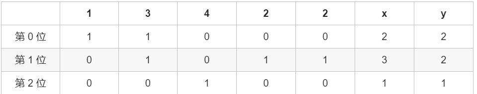

# 位运算
## 位运算介绍
### 137. 只出现一次的数字 II
一个数只出现一次，其余的数都出现3次

思路：逐位求和，然后对3取余
```cpp
class Solution {
public:
    int singleNumber(vector<int>& nums) {
        int bit_max = 32;//有32位
        int sum = 0;
        int res = 0;
        for(int i = 0;i<bit_max;i++){
            sum = 0;
            for(int num:nums){
                sum += (num >> i) & 1; //获取当前数的当前位的1的个数
            }
           if(sum%3 != 0)
                res |= (1<<i);
        }
            return res;
    }

};
```
### 137. 只出现一次的数字 III
两个数字出现一次，其余出现两次
思路：
1.先全部异或
2.取最低非0位
3.分组异或
```cpp
class Solution {
public:
    vector<int> singleNumber(vector<int>& nums) {

        long x = 0;//leetcode里面有个数据集报错用int的话
        long mask;
        vector<int> res{0,0};
        for(int num:nums){
            x ^= num;
        }
        //这时候结果是两个唯一的数异或
        mask = x & (-x);//-xor为xor取反加一，可以获得最低的非0位。

        for(int num:nums){
            if((num & mask) == 0)
                res[0] ^= num;
            else
                res[1] ^= num;
        }
        return res;
    }
};
```
### 287.寻找重复数
给定一个包含 n + 1 个整数的数组 nums ，其数字都在 1 到 n 之间（包括 1 和 n），可知至少存在一个重复的整数。

如果重复了，x>y
```cpp
//NlogN 1
class Solution {
public:
    int findDuplicate(vector<int>& nums) {
        int n = nums.size(), ans = 0;
        // 确定二进制下最高位是多少
        int bit_max = 31;
        while (!((n - 1) >> bit_max)){
            bit_max -= 1;
        }
        for (int bit = 0; bit <= bit_max; ++bit) {
            int x = 0, y = 0;
            for (int i = 0; i < n; ++i) {
                if (nums[i] & (1 << bit)) {
                    x += 1;
                }
                if (i >= 1 && (i & (1 << bit))) {
                    y += 1;
                }
            }
            if (x > y) {
                ans |= 1 << bit;
            }
        }
        return ans;
    }
};
```