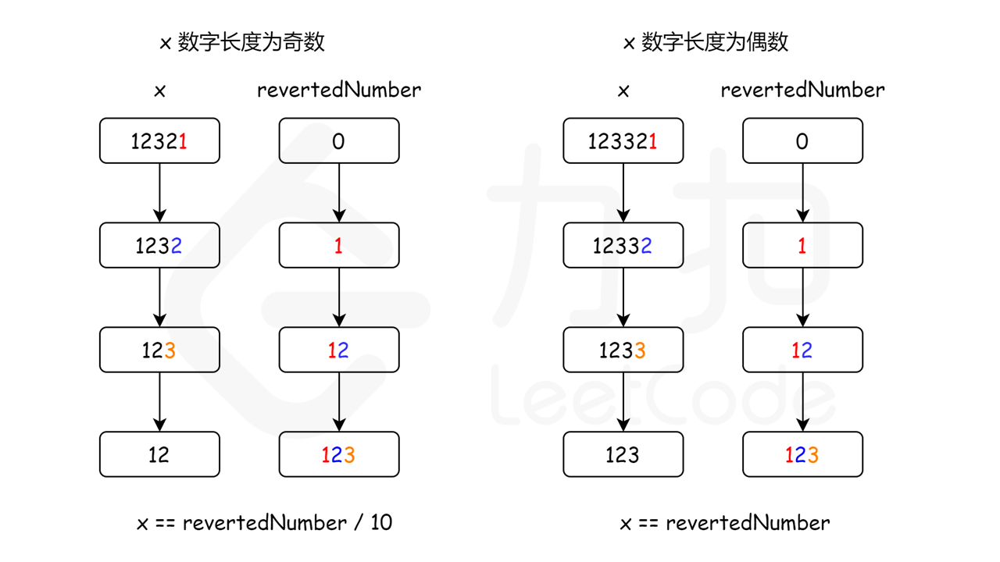

# 数学题
### 7.整数翻转

给你一个 32 位的有符号整数 x ，返回将 x 中的数字部分反转后的结果。
如果反转后整数超过 32 位的有符号整数的范围 [−231,  231 − 1] ，就返回 0。
```cpp
//O(logn) o(1)
class Solution {
public:
    int reverse(int x) {
        int res = 0;
        while(x!=0){
            //这题的难点在于处理数据越界！！！
            if (res < INT_MIN / 10 || res > INT_MAX / 10) {
                return 0;
            }
            int mod = x%10;
            x /= 10;
            res = res*10 + mod;
        }
        return res;
    }
};
```

### 9.回文数
判断这个数字是不是回文

```cpp
//O(logN) O(1)
class Solution {
public:
    bool isPalindrome(int x) {
        if(x < 0 || (x%10 == 0 && x != 0))
            return false;//负数肯定不是
        int mod = 0;
        while(mod < x){
            mod = mod*10 +x%10;
            x /= 10;  
        }

        if(x == mod || (mod/10) == x)
            return true;
        return false;
    }
};
```
### 13.罗马数字
把罗马数字转化为数字
```cpp
class Solution {
public:
    int romanToInt(string s) {
        map<char,int> roman = {
            {'I',1},
            {'V',5},
            {'X',10},
            {'L',50},
            {'C',100},
            {'D',500},
            {'M',1000},
        };
        int num = 0;
        int len = s.length();
        num += roman[s[len-1]];
        for(int i = len-2;i>=0;i--){
            if(roman[s[i+1]]>roman[s[i]]){
                num -=  roman[s[i]];
            }
            else
                num += roman[s[i]];
        }


        return num;
    }
};
```
### 49.图像旋转
将一个二维数组逆时针旋转90°
思路看49题解吧
1.原地旋转
```cpp
//O（N*N） O（1）
class Solution {
public:
    void rotate(vector<vector<int>>& matrix) {
        int size = matrix.size();
        for(int i = 0;i<size/2;i++){//有几圈
            for(int j = 0;j<(size+1)/2;j++){
                int temp = matrix[i][j];
                matrix[i][j] = matrix[size-1-j][i];
                matrix[size-1-j][i] = matrix[size-1-i][size-1-j];
                matrix[size-1-i][size-1-j] = matrix[j][size-1-i];
                matrix[j][size-1-i] = temp;
            }
        }
    }
};
```
2.原地翻转
```cpp
class Solution {
public:
    void rotate(vector<vector<int>>& matrix) {
        int size = matrix.size();
        //水平翻转
        for(int i = 0;i<size;i++){
            for(int j = 0;j<size/2;j++){
                swap(matrix[j][i],matrix[size-j-1][i]);
            }
        }
        //对角线翻转
        for(int i = 0;i<size;i++){
            for(int j = 0;j<i;j++){
                swap(matrix[i][j],matrix[j][i]);
            }
        }
    }
};
```

###66. 加一
```
输入：digits = [1,2,3]
输出：[1,2,4]
解释：输入数组表示数字 123。
```
```cpp
class Solution {
public:
    vector<int> plusOne(vector<int>& digits) {
        int add = 0;//进位


        for(auto it = digits.rbegin();it!= digits.rend();it++){
            if(it == digits.rbegin()){
                *it = (*it)+1;
                add = (*it)/10;
                *it = (*it)%10;
            }
            else{
                if(add){
                    *it = (*it)+1;
                    add = (*it)/10; 
                    *it = (*it)%10;
                }
                else
                    break;

            }
        }

        if(add){
            digits.insert(digits.begin(),1);
        }

        return digits;
    }
};
```
### 118.杨辉三角
给定一个非负整数 numRows，生成杨辉三角的前 numRows 行。

在杨辉三角中，每个数是它左上方和右上方的数的和。
```cpp
//O(n*n),o(1)
class Solution {
public:
    vector<vector<int>> generate(int numRows) {
        vector<vector<int>> tri;
        for(int i = 0;i<numRows;i++){
            vector<int> row;
            for(int j=0;j<=i;j++){
                if((i <= 1)||(j == 0)||(j == i))
                    row.push_back(1);
                else{
                    row.push_back(tri[i-1][j]+tri[i-1][j-1]);
                }
            }
            tri.push_back(row);
        }
        return tri;
    }
};
```
### 204.计算质数
1.枚举法（leetcode超时）
```cpp
//O(n sqrt(n) ) O(1)
class Solution {
public:
    int countPrimes(int n) {
        int num = 0;
        bool none = 0;
        if(n>2){
            for(int i = 2;i<n;i++){
                int k=(int)sqrt((double)i);
                for(int j = 2;j<=k;j++){
                    if(i%j == 0){
                        none = 1;
                        break;
                    }
                }

                if(!none){
                    num++;
                }
                none = 0;
            }
        }       
        return num;
    }
};
```

2.埃氏筛
```cpp
class Solution {
public:
    int countPrimes(int n) {
        vector<int> isPrime(n, 1);
        int ans = 0;
        for (int i = 2; i < n; ++i) {
            if (isPrime[i]) {
                ans += 1;
                if ((long long)i * i < n) {
                    for (int j = i * i; j < n; j += i) {
                        isPrime[j] = 0;
                    }
                }
            }
        }
        return ans;
    }
};


```
3.线性筛
```cpp
class Solution {
public:
    int countPrimes(int n) {
        vector<int> pirme;
        vector<int> isprime(n,true);

        for(int i = 2;i<n;i++){
            if(isprime[i]){
                pirme.push_back(i);
            }
            for(int j = 0;j<pirme.size()&&i*pirme[j]<n;j++)
                isprime[i*pirme[j]] = false;
            
        }
        return pirme.size();
    }
};
```
### 268. 丢失的数字
给定一个包含 [0, n] 中 n 个数的数组 nums ，找出 [0, n] 这个范围内没有出现在数组中的那个数。其中数组中每个数字都是独一无二的

思路：高斯求和公式
```cpp
class Solution {
public:
    int missingNumber(vector<int>& nums) {
        int sum1 = 0;
        int sum2 = (0+nums.size())*(nums.size()+1)/2;
        for(int num : nums){
            sum1 += num;
        }
        return (sum2-sum1);
    }
};
```
### 326. 3的幂
判断是不是3的幂

循环迭代法
O(logn) O(1)
```cpp
class Solution {
public:
    bool isPowerOfThree(int n) {
        if(n<1)
            return false;

        int num = n;
        while(num %3 == 0){
            num /= 3;
        }
        return num== 1;
    }    
};
```